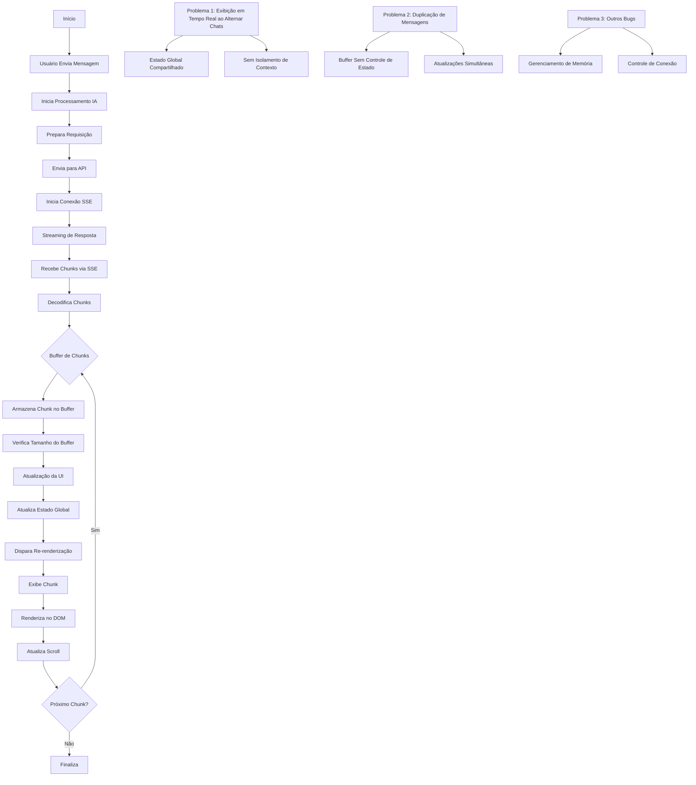
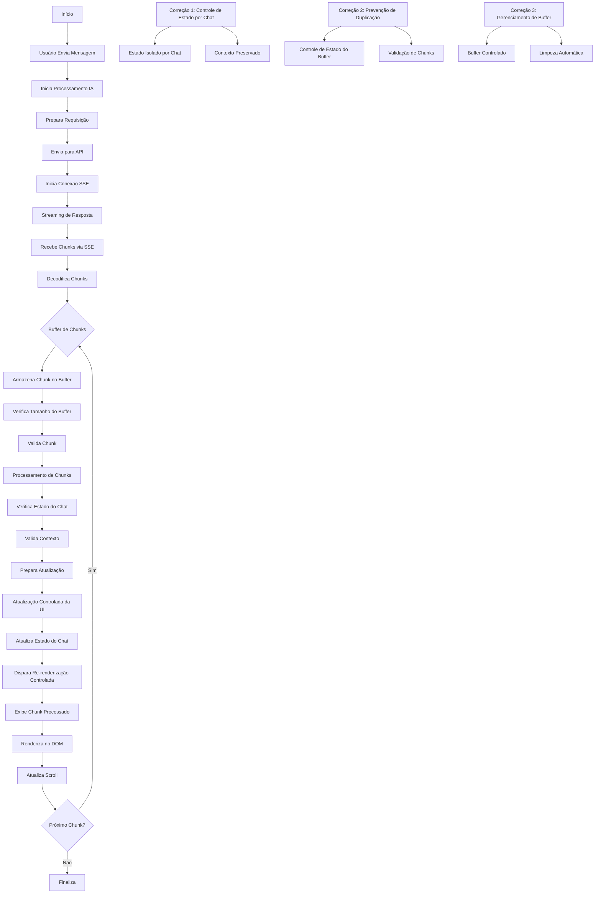

**Introdução**

Atualmente, estou desenvolvendo um sistema de chat utilizando Flask e SocketIO, com o objetivo de implementar um efeito de streaming em tempo real para as respostas da inteligência artificial. Estou inspirado no funcionamento do OpenWebUI, que apresenta uma experiência de usuário fluida e interativa. No entanto, meu sistema, que está na versão atual, enfrenta alguns desafios que precisam ser superados para alcançar a funcionalidade desejada.

**Objetivos do Projeto**

O principal objetivo é permitir que as respostas da IA sejam exibidas gradualmente, com um efeito de fade-in, à medida que os chunks de texto são recebidos. Atualmente, quando uma mensagem é enviada, uma animação de "Gerando resposta..." aparece, mas o frontend só exibe o texto completo após o evento `response_complete`. Isso impede que os usuários vejam a resposta da IA em tempo real, o que é uma parte crucial da experiência que desejo oferecer.

**Comparação com OpenWebUI**

Para aprimorar meu sistema, gostaria de comparar a forma como o OpenWebUI gerencia o streaming de mensagens com a abordagem que estou utilizando atualmente. O OpenWebUI parece ter uma implementação mais eficiente, permitindo que os chunks de texto sejam exibidos de maneira contínua e suave, sem criar elementos extras ou causar duplicações. Além disso, a animação de digitação em tempo real é uma característica que gostaria de replicar em meu projeto.

**Descrição do Sistema Atual**

No estado atual do meu sistema, o backend está enviando os chunks de texto corretamente, como indicado pelos logs que mostram "[Conversa: <id>] Chunk: X caracteres". No entanto, no frontend, os chunks não aparecem em tempo real. Os logs do `chatUI.js` indicam que, embora o sistema esteja tentando adicionar os chunks, ocorre um erro que diz: "[ERRO] Mensagem não encontrada para adicionar chunk: <messageId>". Isso sugere que a mensagem inicial do assistente, que exibe a animação de carregamento, está sendo removida ou substituída por uma atualização assíncrona (`conversation_updated`) antes que os chunks sejam adicionados, resultando na perda da mensagem no DOM.

**Versão Anterior do Sistema**

Na versão anterior do meu sistema, a funcionalidade de exibir mensagens em chunks estava implementada, mas apresentava problemas, como a duplicação de mensagens ao alternar entre janelas de chat. Embora essa versão tenha permitido a visualização em tempo real, ela também tinha suas falhas, como a falta de controle de estado e a exibição de mensagens duplicadas. A versão atual resolveu muitos desses bugs, mas gostaria de recuperar a lógica de apresentação de mensagens em chunks da versão antiga, que funcionava corretamente.

**Desafios e Problemas Identificados**

Os principais desafios que estou enfrentando incluem:

1. **Remoção da Mensagem Inicial**: A mensagem inicial do assistente, que exibe a animação de carregamento, é removida ou substituída antes que os chunks sejam adicionados, fazendo com que o frontend perca essa informação no DOM.

2. **Exibição dos Chunks**: Apesar de tentativas de ajustar o `chatUI.js` e `chatActions.js` para marcar a mensagem como "streaming-message" e adicionar os chunks com transparência, o erro persiste, e os chunks não aparecem em tempo real.

3. **Placeholder Único**: O objetivo é manter um único placeholder para o streaming, evitando a criação de elementos extras ou duplicações que possam confundir o usuário.

Conclusão e Propostas de Melhoria

Ao comparar a versão antiga do meu sistema de chat com a versão atual e o projeto OpenWebUI, é evidente que existem oportunidades significativas para aprimorar a funcionalidade de streaming em tempo real.

Na versão antiga, a exibição de mensagens em chunks funcionava de maneira eficaz, permitindo que os usuários vissem as respostas da IA à medida que eram geradas. No entanto, essa versão apresentava problemas, como a duplicação de mensagens ao alternar entre janelas de chat, devido à falta de controle de estado e isolamento de contexto. Por outro lado, a versão atual resolveu muitos desses bugs, implementando um estado isolado por chat e um gerenciamento de buffer mais eficiente, mas ainda não conseguiu replicar a experiência de visualização em tempo real que a versão antiga oferecia.

O OpenWebUI, por sua vez, se destaca na forma como gerencia o streaming de mensagens. Ele permite que os chunks de texto sejam exibidos de maneira contínua e suave, sem criar elementos extras ou causar duplicações. Além disso, a animação de digitação em tempo real proporciona uma experiência mais envolvente para o usuário.

Com base nessa análise, proponho as seguintes melhorias para o meu sistema atual:

Recuperação da Lógica de Chunks: Integrar a lógica de apresentação de mensagens em chunks da versão antiga, que permitia a visualização gradual das respostas, enquanto se mantém o controle de estado e o isolamento de contexto da versão atual.

Placeholder de Carregamento: Implementar um placeholder que exiba "Gerando resposta..." e que seja removido assim que o primeiro chunk for recebido, permitindo que o usuário veja a resposta da IA imediatamente.

Efeito de Fade-in para Chunks: Adicionar um efeito de fade-in para a exibição dos chunks, simulando uma digitação em tempo real, como visto no OpenWebUI. Isso pode ser feito utilizando animações CSS ou JavaScript.

Finalização com Resposta Completa: Ao final do streaming, substituir o placeholder pela resposta completa, garantindo que a renderização de Markdown seja preservada e que a formatação correta seja mantida.

Validação de Chunks: Implementar um sistema de validação para garantir que apenas os chunks relevantes sejam exibidos, evitando a duplicação de mensagens e melhorando a experiência do usuário.

Essas melhorias visam não apenas restaurar a funcionalidade de streaming em tempo real que funcionava na versão antiga, mas também incorporar as melhores práticas do OpenWebUI, resultando em uma experiência de chat mais fluida e interativa. Estou ansioso para implementar essas mudanças e ver como elas podem transformar a interação dos usuários com a inteligência artificial em meu sistema de chat.

---
# Fluxogramas Detalhados do Sistema de Chat
criei um diagramas detalhados mostrando as diferenças entre as versões antiga e nova do sistema. 

## Versão Nova (Corrigida)

## Principais Diferenças Detalhadas

1. **Controle de Estado**
   - Versão Antiga:
     - Estado global compartilhado entre todos os chats
     - Sem isolamento de contexto
     - Atualizações simultâneas causando conflitos
   - Versão Nova:
     - Estado isolado por chat
     - Contexto preservado durante alternância
     - Sistema de filas para atualizações

2. **Processamento de Chunks**
   - Versão Antiga:
     - Processamento direto sem validação
     - Atualização imediata da UI
     - Sem controle de ordem
   - Versão Nova:
     - Validação de chunks antes do processamento
     - Verificação de estado do chat
     - Controle de ordem de processamento

3. **Gerenciamento de Buffer**
   - Versão Antiga:
     - Buffer simples sem controle
     - Sem limpeza automática
     - Acúmulo de dados não processados
   - Versão Nova:
     - Buffer com controle de estado
     - Sistema de deduplicação
     - Limpeza automática de dados processados

4. **Atualização da UI**
   - Versão Antiga:
     - Atualização imediata sem contexto
     - Re-renderização completa
     - Problemas de performance
   - Versão Nova:
     - Atualização controlada com contexto
     - Re-renderização otimizada
     - Melhor performance

5. **Tratamento de Erros**
   - Versão Antiga:
     - Tratamento básico de erros
     - Sem recuperação de estado
   - Versão Nova:
     - Tratamento robusto de erros
     - Sistema de recuperação de estado
     - Logging detalhado

6. **Performance**
   - Versão Antiga:
     - Consumo excessivo de memória
     - Latência na atualização
     - Problemas de escalabilidade
   - Versão Nova:
     - Gerenciamento eficiente de memória
     - Atualização otimizada
     - Melhor escalabilidade 

