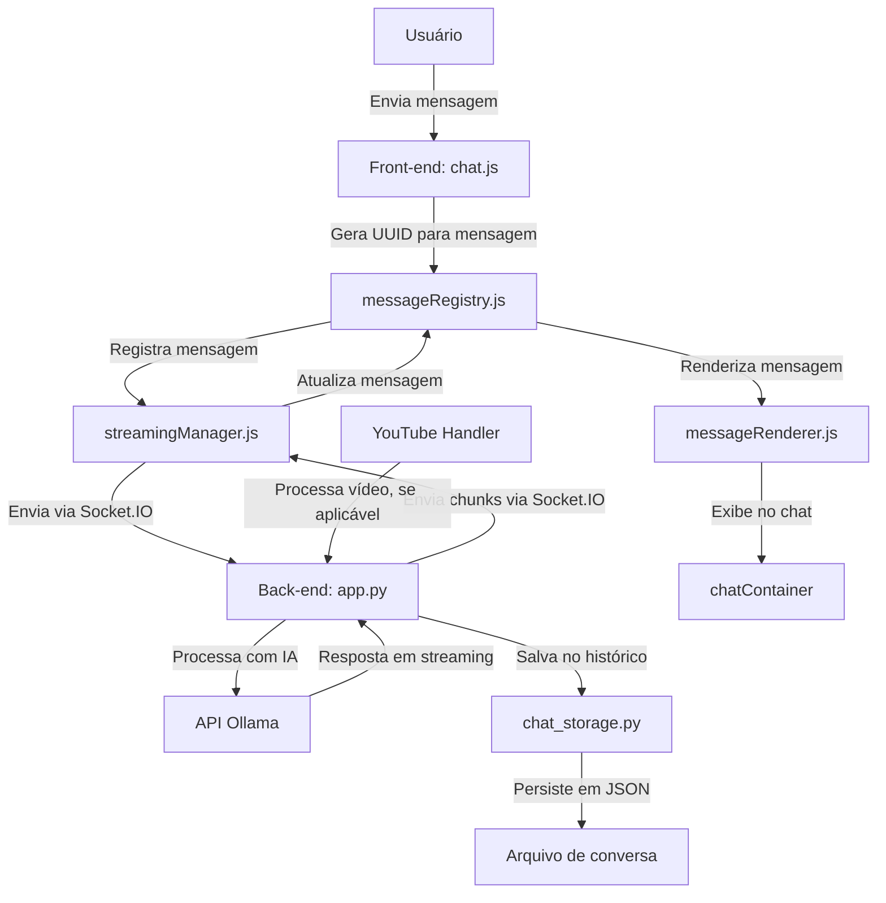

# Plano de Implementação - Sistema de Chat com Feedback Visual

## Visão Geral
Este documento apresenta o plano de implementação para resolver os problemas de duplicação de mensagens, melhorar o feedback visual durante o carregamento e aprimorar a arquitetura do sistema de chat.

## Fases de Implementação

### Fase 1: Preparação e Limpeza Inicial (3 Horas)

1. **Revisão do Fluxo Atual (1 Hora)**
   - Mapear os componentes: `streamingManager.js`, `messageRenderer.js`, `chatActions.js` e `messageRegistry`
   - Identificar pontos de geração de IDs e comunicação entre canais
   - Resultado: Diagrama de fluxo do estado atual do sistema

2. **Escolha do Canal Único (1 Hora)**
   - Padronizar usando Socket.IO como meio exclusivo de comunicação
   - Remover código relacionado a SSE (Server-Sent Events) do backend
   - Resultado: Backend mais enxuto e menor chance de duplicação de mensagens

3. **Centralização do messageRegistry (1 Hora)**
   - Criar módulo único para o `messageRegistry`
   - Garantir importação consistente em todos os arquivos
   - Resultado: Sistema de registro de mensagens consistente e confiável

### Fase 2: Implementação da Padronização de IDs (4 Horas)

4. **Geração de UUID no Backend (1 Hora)**
   - Modificar `app.py` para gerar UUID único por mensagem
   - Enviar UUID via Socket.IO com cada mensagem
   - Resultado: IDs consistentes em todo o ciclo da mensagem

5. **Ajuste no Frontend (1 Hora)**
   - Adaptar `streamingManager.js` para usar UUIDs do backend
   - Atualizar `messageRenderer.js` para renderização baseada em UUID
   - Resultado: Frontend alinhado com backend, evitando duplicações

6. **Integração com messageRegistry (1 Hora)**
   - Implementar UUID como chave primária no registry
   - Adicionar verificação de duplicação
   - Resultado: Controle centralizado de mensagens

7. **Testes Básicos (1 Hora)**
   - Testar fluxo de mensagens com UUIDs
   - Verificar se duplicações foram eliminadas
   - Resultado: Confirmação da solução básica funcionando

### Fase 3: Refatoração e Consolidação (4 Horas)

8. **Remoção Completa do SSE (1 Hora)**
   - Eliminar endpoint `/stream` e código relacionado
   - Consolidar toda comunicação via Socket.IO
   - Resultado: Canal único de comunicação

9. **Centralização do Streaming (1 Hora)**
   - Tornar `streamingManager.js` o controlador central de eventos
   - Simplificar relacionamento com `messageRenderer.js`
   - Resultado: Fluxo de streaming mais limpo e organizado

10. **Logs e Verificação (1 Hora)**
    - Implementar sistema de log para ciclo de vida das mensagens
    - Monitorar comportamento do UUID em todo o fluxo
    - Resultado: Verificação em tempo real do funcionamento

11. **Testes de Integração (1 Hora)**
    - Testar cenários complexos: mensagens normais, YouTube, streaming pesado
    - Validar comportamento do sistema sob carga
    - Resultado: Sistema estável em condições reais

### Fase 4: Documentação e Finalização (2 Horas)

12. **Atualização da Documentação (1 Hora)**
    - Documentar nova arquitetura e fluxo de mensagens
    - Criar diagramas atualizados do sistema
    - Resultado: Documentação clara para futura manutenção

13. **Revisão Final (1 Hora)**
    - Revisar implementação completa
    - Testar sistema end-to-end
    - Resultado: Sistema finalizado e estável

## Total: 13 Horas de Implementação

## Diagrama de Fluxo Final

## Principais Arquivos e Funções

### Frontend
- **chat.js**: Captura mensagens e gerencia interação inicial
- **messageRegistry.js**: Centraliza rastreamento via UUID
- **streamingManager.js**: Gerencia comunicação em tempo real
- **messageRenderer.js**: Renderiza mensagens no chat
- **youtubeHandler.js**: Processa conteúdo do YouTube

### Backend
- **app.py**: Processamento central e integração com IA
- **chat_storage.py**: Persistência do histórico de conversas 