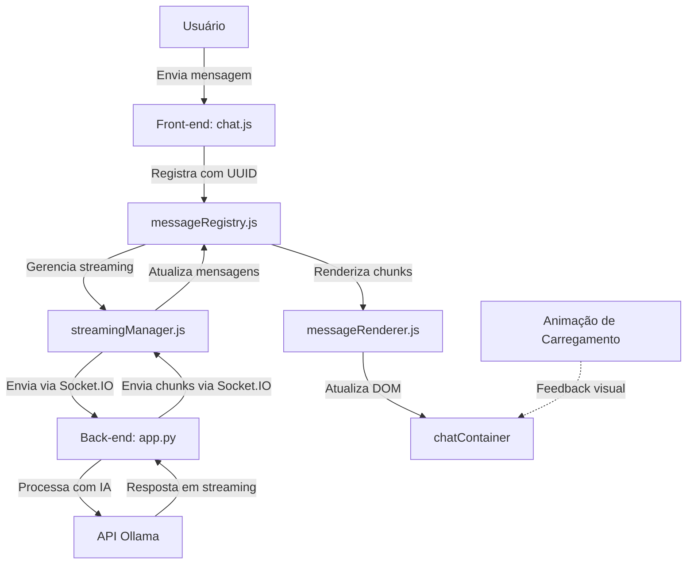

# Documentação do Sistema de Chat com Streaming

## Visão Geral do Sistema

O sistema implementa um chat interativo com suporte a streaming de mensagens, permitindo visualização em tempo real da resposta da IA. O sistema conta com um mecanismo de feedback visual durante o carregamento e tratamento robusto de mensagens para evitar duplicações.

## Arquitetura Geral

### Componentes Principais

1. **Frontend**:
   - **chat.js**: Gestão de interface e interação de usuário
   - **messageRegistry.js**: Sistema central de rastreamento de mensagens
   - **streamingManager.js**: Gerencia streaming de mensagens
   - **messageRenderer.js**: Renderiza as mensagens no chat
   - **youtubeHandler.js**: Integração com recursos do YouTube

2. **Backend**:
   - **app.py**: Processamento de mensagens e integração com IA
   - **chat_storage.py**: Persistência das conversas

3. **Integrações**:
   - Socket.IO para comunicação bidirecional em tempo real
   - API de IA para geração de respostas (Ollama)
   - Processamento de vídeos do YouTube

## Fluxo de Dados

1. Usuário envia mensagem através da interface
2. Frontend registra a mensagem no messageRegistry com UUID único
3. streamingManager envia para o backend via Socket.IO
4. Backend processa com IA e retorna chunks de resposta via Socket.IO
5. streamingManager recebe os chunks e atualiza o messageRegistry
6. messageRenderer exibe a resposta em tempo real no chat
7. Após completar, a mensagem é armazenada no histórico

## Sistema de Feedback Visual

### Problema Original Resolvido

O sistema antigo de feedback visual durante o carregamento ("três pontinhos") apresentava problemas:
1. O cursor antigo ("Gerando resposta...") persistia no DOM
2. Containers vazios eram criados, poluindo a interface
3. Erro no código: `TypeError: messageRegistry.forEach is not a function`

### Solução Implementada

1. **Eliminação do Cursor Antigo**:
   - Substituição por animação de carregamento centralizada
   - Remoção de todos os pontos de criação do cursor antigo em:
     - `chatActions.js` (função `carregarConversa`)
     - `chatSync.js` (evento `message_chunk`)
     - `streamingManager.js` (método `createMessageContainer`)

2. **Integração da Animação Centralizada**:
   - Elemento HTML único para feedback visual
   - Controle centralizado em pontos-chave:
     - Ao enviar mensagem
     - Ao receber o primeiro chunk
     - Ao completar a resposta
     - Em caso de erro
     - Ao interromper a resposta

3. **Correção de Bugs**:
   - Corrigido método `cleanupOrphan` para usar iteração correta sobre Maps
   - Removidas referências à classe `.streaming-message` em seletores

### Código de Implementação

**HTML da Animação (index.html)**:
```html
<!-- Animação de carregamento centralizada -->
<div id="loading-animation" style="display: none;">
    <div class="loading-spinner">
        <i class="fas fa-spinner fa-spin"></i>
        <span>Processando...</span>
    </div>
</div>
```

**Estilos CSS (streaming.css)**:
```css
#loading-animation {
    position: fixed;
    top: 50%;
    left: 50%;
    transform: translate(-50%, -50%);
    z-index: 1000;
    background: rgba(0, 0, 0, 0.7);
    padding: 15px 25px;
    border-radius: 8px;
    color: #fff;
    box-shadow: 0 2px 10px rgba(0, 0, 0, 0.3);
}

.loading-spinner {
    display: flex;
    align-items: center;
    gap: 10px;
}

.loading-spinner i {
    font-size: 1.5rem;
}

.loading-spinner span {
    font-family: 'Inter', sans-serif;
    font-size: 1rem;
}
```

**Manipulação em JavaScript**:
```javascript
// Mostrar animação
const loadingAnimation = document.getElementById('loading-animation');
if (loadingAnimation) {
    loadingAnimation.style.display = 'block';
    logger.debug('Animação de carregamento exibida');
}

// Ocultar animação
if (loadingAnimation && loadingAnimation.style.display === 'block') {
    loadingAnimation.style.display = 'none';
    logger.debug('Animação de carregamento ocultada');
}
```

## Sistema de Streaming de Mensagens

### Implementação do Streaming

O sistema de streaming permite visualização em tempo real das respostas, com as seguintes características:

1. **Containers Unificados**:
   - Um único container por mensagem
   - Identificação via UUID para evitar duplicação
   - Atualização via chunks em tempo real

2. **Renderização Incremental**:
   - Markdown processado em tempo real
   - Exibição de cursor durante digitação
   - Transição suave entre estados

3. **Gerenciamento de Estado**:
   - Controle centralizado via messageRegistry
   - Limpeza automática de containers órfãos
   - Mecanismo de recuperação pós-erro

### Streaming Manager

O StreamingManager é o componente central que:
1. Gerencia os listeners de Socket.IO
2. Processa chunks de mensagem
3. Atualiza o messageRegistry
4. Coordena renderização via messageRenderer
5. Gerencia o ciclo de vida das mensagens

## Resolução de Problemas Comuns

### Duplicação de Mensagens

**Solução**:
- Uso de UUIDs consistentes durante todo o ciclo da mensagem
- Verificação no messageRegistry antes de criar novos containers
- Limpeza automática de containers órfãos

### Containers Vazios

**Solução**:
- Criação de containers apenas quando há conteúdo real
- Sistema de cleanup periódico via `cleanupOrphan()`
- Melhor gerenciamento de ciclo de vida dos containers

### Conflitos de Renderização

**Solução**:
- Centralização da lógica de renderização
- Sistema de fila para processamento de chunks
- Uso de debounce para evitar atualizações excessivas

## Considerações para o Futuro

1. O código antigo dos "três pontinhos" foi preservado em formato de comentário para referência
2. A estrutura atual suporta extensão para animações mais elaboradas
3. O sistema está documentado com logs para facilitar a manutenção

## Diagrama do Sistema

