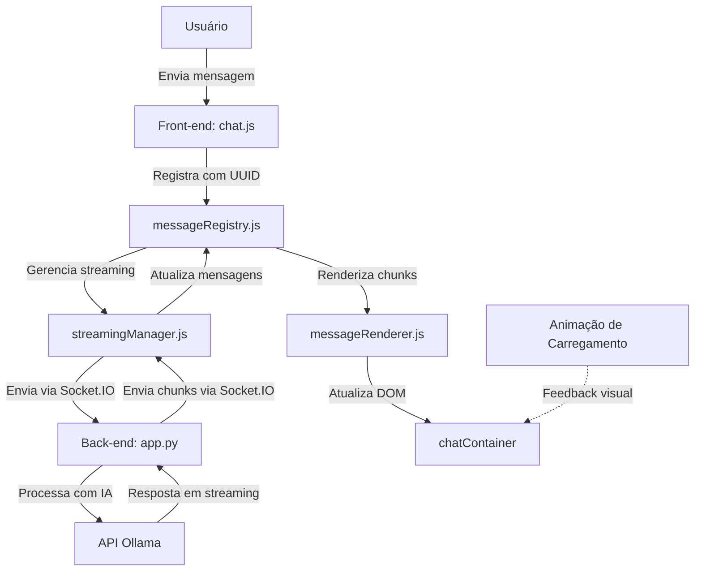

Conteúdo de 1- documentação.md:
Segue a primeira parte da documentação, organizada de acordo com o esquema proposto. Essa seção abrange a **Introdução e Objetivos** e está escrita de forma a oferecer uma visão clara do sistema, seu estado atual e as metas pretendidas para os refinamentos e futuras melhorias.

---

# 1. Introdução e Objetivos

## 1.1. Visão Geral do Sistema
O sistema em desenvolvimento é uma aplicação de conversação que integra diferentes funcionalidades, incluindo:
- **Transcrição de Vídeos do YouTube:** Captação e processamento de legendas dos vídeos.
- **Resumo de Vídeos do YouTube:** Processamento dos dados transcritos para gerar resumos concisos dos conteúdos.
- **Interação com uma Inteligência Artificial (IA):** Permite que os usuários façam consultas e recebam respostas processadas em tempo real via streaming, com formatação em Markdown e sanitização de conteúdos.

Atualmente, as funcionalidades de transcrição, resumo e interação via IA estão implementadas e estão em operação. O sistema também utiliza comunicação em tempo real através do Socket.IO, permitindo que os dados sejam transmitidos dinamicamente para o frontend enquanto o processamento ocorre no backend.

## 1.2. Contexto e Estado Atual
- **Funcionalidades Consolidadas:**  
  - A transcrição dos vídeos do YouTube está operando conforme o esperado.
  - O resumo dos vídeos (YouTube Resumo) já foi implementado e é funcional.
  - A conversa com a IA (processamento dos textos e streaming de respostas) está estabelecida, com a renderização incremental no frontend utilizando técnicas como Markdown e DOMPurify para a sanitização.
- **Pontos de Atenção:**  
  - A linha de raciocínio e a documentação atual estão desatualizadas e contêm trechos de rascunhos antigos, informações redundantes e detalhes que não refletem mais o estado operacional do sistema.
  - Alguns aspectos anteriores relacionados ao acúmulo e duplicação de chunks de resposta, ou processos de re-renderização de conteúdo final, já foram refinados na última versão (documentação número 3).
  - Existe a necessidade de alinhar a documentação com o que já foi implementado, destacando a arquitetura de isolamento por `conversation_id` que garante que as mensagens e respostas sejam exibidas somente no chat correspondente.


## 1.3. Objetivos da Documentação
Esta documentação tem como finalidade:
- **Clarificar o Funcionamento do Sistema:**  
  - Descrever detalhadamente os componentes internos (backend, frontend, utilitários) e como eles interagem para oferecer as funcionalidades de transcrição, resumo e comunicação com a IA.
- **Documentar o Estado Atual e as Funcionalidades Implementadas:**  
  - Registrar quais módulos já estão consolidados (por exemplo, a função do YouTube Resumo) e como eles operam dentro do fluxo do sistema.
- **Identificar Pontos para Refinamento:**  
  - Especificar quais aspectos ainda necessitam de ajustes, como melhorias no layout (animação de carregamento, botão de Stop), tratamento de erros e aprimoramentos na experiência de usuário, sem impactar o que já funciona.
- **Fornecer uma Base para Novos Desenvolvedores ou Inteligências de Suporte:**  
  - Facilitar a compreensão rápida do sistema para que seja possível dar continuidade ao desenvolvimento ou manutenção com clareza sobre quais partes são essenciais, quais já foram implementadas e quais podem ser descartadas ou simplificadas na documentação final.

## 1.4. Escopo e Abordagem
- **Escopo:**  
  - A documentação abrangerá tanto os aspectos técnicos (arquivos e seu conteúdo, fluxos de dados, integrações) quanto os pontos de melhoria e refinamento necessários para evoluir o sistema de forma coesa.
- **Abordagem:**  
  - Inicialmente, serão identificados e descritos os principais arquivos e módulos que compõem a linha de raciocínio (tanto do backend quanto do frontend).
  - Em seguida, será feita uma análise de quais pontos e funcionalidades já estão consolidados, quais informações estão desatualizadas e como eliminar redundâncias para uma versão final mais fluida.
  - Serão listados também os refinamentos pendentes, que devem ser considerados para futuras iterações sem comprometer a estabilidade do fluxo principal (especialmente o isolamento via `conversation_id` e o processamento assíncrono via Socket.IO).

---

# 2. Identificação dos Arquivos do Projeto

## 2.1. Arquivos do Backend

### **app.py**  
- **Função Principal:**  
  - É o núcleo do servidor Flask, responsável por definir as rotas e endpoints do sistema.  
- **Principais Responsabilidades:**  
  - **Rotas e Endpoints:** Gerencia a página inicial, criação, recuperação, atualização e exclusão de conversas.  
  - **Integração com Socket.IO:** Configura a comunicação em tempo real, associando os clientes a salas (com base no `conversation_id`) e emitindo eventos como `message_chunk` e `response_complete`.  
  - **Processamento de Mensagens:** Trata os comandos enviados pelo usuário, diferenciando entre as requisições para a inteligência artificial e os comandos específicos para o YouTube (por exemplo, `/youtube` e `/youtube_resumo`).  
  - **Streaming de Respostas:** Implementa o envio de respostas em tempo real (chunks) para o frontend, permitindo a renderização incremental enquanto o processamento ocorre no backend.

### **init_eventlet.py**  
- **Função Principal:**  
  - Inicializa o ambiente assíncrono utilizando o Eventlet.  
- **Principais Responsabilidades:**  
  - **Monkey Patching do Eventlet:** Assegura que todas as operações ocorram de maneira compatível com o processamento assíncrono, preparando o ambiente para a execução do servidor Flask com suporte a eventos.

### **youtube_handler.py**  
- **Função Principal:**  
  - Contém toda a lógica relativa ao processamento de vídeos do YouTube.  
- **Principais Responsabilidades:**  
  - **Download de Legendas:** Utiliza ferramentas (como o yt-dlp) para baixar as legendas dos vídeos do YouTube.  
  - **Limpeza e Formatação:** Processa as legendas removendo formatações indesejadas e caracteres especiais, preparando o texto para exibição e para a geração de resumos.  
  - **Divisão em Chunks:** Pode incluir a lógica para dividir a transcrição em partes menores, facilitando o processamento e o resumo de cada bloco.

### **text_processor.py**  
- **Função Principal:**  
  - Fornece funções auxiliares para manipulação e formatação de texto.  
- **Principais Responsabilidades:**  
  - **Divisão de Texto:** Separa textos longos em blocos ou chunks de tamanho adequado para processamento.  
  - **Limpeza e Formatação:** Aplica regras para padronizar o conteúdo textual, removendo quebras de linha desnecessárias e ajustando espaçamentos, para garantir consistência na renderização.

### **chat_storage.py**  
- **Função Principal:**  
  - Gerencia o armazenamento e o histórico das conversas.  
- **Principais Responsabilidades:**  
  - **Criação de Conversas:** Implementa a criação de novas conversas, assegurando que cada conversa receba um identificador único (`conversation_id`).  
  - **Armazenamento de Mensagens:** Salva, atualiza e exclui mensagens associadas a cada conversa, geralmente utilizando arquivos JSON para persistência.  
  - **Gerenciamento do Histórico:** Permite a recuperação e o gerenciamento do histórico de conversas, facilitando o acesso aos dados anteriores.

---

## 2.2. Arquivos do Frontend

### **chatUI.js**  
- **Função Principal:**  
  - Gerencia a interface do chat e a interação do usuário.  
- **Principais Responsabilidades:**  
  - **Captura de Entrada:** Lida com o input do usuário para envio de mensagens e comandos.  
  - **Interação com o Backend:** Dispara eventos e chamadas aos endpoints para enviar comandos e receber respostas via Socket.IO.  
  - **Gerenciamento de Sala:** Executa funções para juntar ou sair de salas com base no `conversation_id`, garantindo que as mensagens sejam exibidas no chat correto.

### **messageRenderer.js**  
- **Função Principal:**  
  - Responsável pela renderização das mensagens no DOM.  
- **Principais Responsabilidades:**  
  - **Conversão de Markdown:** Utiliza a biblioteca `marked` para converter o conteúdo das mensagens em Markdown para HTML.  
  - **Sanitização:** Aplica o DOMPurify para sanitizar o HTML gerado, garantindo segurança e evitando a injeção de scripts maliciosos.  
  - **Renderização Incremental:** Trata a atualização em tempo real das respostas (chunks) sem duplicação, utilizando técnicas que evitam a re-renderização do conteúdo final.

### **commandHandler.js**  
- **Função Principal:**  
  - Processa comandos especiais digitados pelo usuário (ex.: `/youtube`, `/youtube_resumo` e outros).  
- **Principais Responsabilidades:**  
  - **Filtragem de Comandos:** Identifica os comandos inseridos pelo usuário e direciona para os handlers específicos.  
  - **Interação com o Backend:** Encaminha as requisições para as rotas correspondentes, garantindo que os comandos sejam processados corretamente e que o fluxo de dados siga o isolamento por `conversation_id`.

### **utils.js**  
- **Função Principal:**  
  - Disponibiliza funções auxiliares que podem ser utilizadas em diversos pontos do Frontend.  
- **Principais Responsabilidades:**  
  - **Escape HTML:** Prover segurança para conteúdos que não passem pelo processo de conversão de Markdown.  
  - **Animações de Carregamento:** Controla a exibição de loaders e placeholders enquanto as respostas estão sendo processadas.  
  - **Outras Utilidades:** Funções diversas que facilitam a manipulação do DOM e o tratamento de erros ou estados especiais na interface.

---

# 3. Análise de Conteúdo Atual

## 3.1. Funcionalidades Consolidadas e Operacionais

### Transcrição e Resumo do YouTube
- **Transcrição:**  
  - A função de transcrição dos vídeos do YouTube já está implementada. O sistema capta as legendas dos vídeos através do módulo do `youtube_handler.py`, realiza o download utilizando ferramentas como yt-dlp, e efetua a limpeza e formatação das legendas.
- **Resumo do YouTube:**  
  - O resumo dos vídeos está funcional. Utiliza a transcrição obtida, divide o conteúdo em blocos (chunks) se necessário e processa cada bloco para gerar um parágrafo resumido. Essa funcionalidade já foi integrada ao backend e está operando de maneira isolada por `conversation_id`, garantindo que os resultados apareçam no chat correto.

### Comunicação com a Inteligência Artificial
- **Processamento de Mensagens e Streaming:**  
  - A interação com a IA, que envolve o envio de mensagens, processamento com streaming e renderização incremental dos chunks de resposta, está consolidada.  
  - O backend (no `app.py`) gerencia o fluxo de mensagens via Socket.IO, isolando as conversas por meio do `conversation_id`, o que permite que a resposta seja renderizada em tempo real sem interferir em outras conversas.

### Gerenciamento de Armazenamento e Histórico
- **Persistência das Conversas:**  
  - O módulo `chat_storage.py` já garante a criação, atualização e armazenamento dos históricos de conversas em arquivos (geralmente JSON), permitindo a recuperação e manutenção dos dados associados a cada conversa.

## 3.2. Elementos que Estão Atualizados

### 3.2.1. Acumulação e Re-renderização Redundante dos Chunks  
**Funcionamento Atual:**  
- O sistema **não acumula chunks no backend**.  
- Cada chunk é enviado individualmente via Socket.IO e renderizado incrementalmente no frontend.  
- O evento `response_complete` finaliza o streaming sem reprocessar o conteúdo, garantindo eficiência.  

---

### 3.2.2. Processamento Manual de Eventos e Logs  
**Padrão Adotado:**  
- Logs são integrados de forma padronizada:  
  ```javascript
  logger.debug('Evento recebido', { conversationId, detalhes }); 
  ```  
- Verificações críticas (ex: `chatId`) são mantidas para evitar vazamentos de contexto.  
- Detalhes internos refinados (ex: `isNearBottom`) são omitidos da documentação, mantendo-se apenas a descrição do comportamento final.  

---

### 3.2.3. Fluxos da IA e do YouTube  
**Arquitetura Unificada:**  
- **Padrão Comum:**  
  - Socket.IO para streaming em tempo real.  
  - Isolamento por `conversation_id`.  
  - Renderização incremental com Markdown/DOMPurify.  
- **Diferenças Específicas:**  
  - **YouTube:**  
    - Download e processamento de legendas via `youtube_handler.py`.  
    - Divisão em blocos de ~300 palavras para resumo.  
  - **IA:**  
    - Integração direta com API de IA para respostas dinâmicas.  


## 3.3. Pontos para Refinamento (Melhorias Pendentes)

- **Ajustes na Interface do Frontend:**  
  - Refinar animações de carregamento e a exibição de placeholders para melhorar a experiência do usuário, garantindo que o conteúdo seja atualizado apenas no chat ativo.
  - Revisar a implementação do botão de Stop, assegurando que ele interrompa efetivamente o streaming, sem deixar processos em segundo plano.

- **Padronização da Renderização e Sanitização:**  
  - Unificar o processo de renderização no frontend, utilizando sempre a conversão com Markdown (via `marked`) seguida pela sanitização com o DOMPurify.
  - Garantir que a função `escapeHTML` seja utilizada somente em casos onde o Markdown não se aplique.

- **Documentação dos Logs e Monitoramento:**  
  - Simplificar a descrição da geração e tratamento dos logs, ressaltando os pontos onde são essenciais para o debug e monitoramento sem entrar em detalhes de implementações que já foram refinadas.

- **Aprimoramento do Isolamento por Conversation_id:**  
  - Validar se todas as requisições e eventos (fetch, SSE, Socket.IO) estão transportando corretamente o `conversation_id` e se a verificação de contexto no frontend (exemplo: `if (response.chatId !== currentChatId) return;`) está garantida.

---

# 4. Refinamentos e Melhorias Necessárias

## 4.1. Ajustes na Interface do Frontend

- **Animação de Carregamento e Placeholders:**
  - **Objetivo:**  
    Garantir que a animação de carregamento seja exibida de forma consistente e que os placeholders sejam criados e removidos apenas no chat ativo.
  - **Melhoria Proposta:**  
    - Utilizar uma classe CSS com `white-space: nowrap` e elementos inline para evitar que a animação quebre a linha.
    - Garantir a remoção imediata da animação assim que a resposta completa for recebida pelo evento `response_complete`.

- **Botão de Stop:**
  - **Objetivo:**  
    Assegurar que o botão de Stop interrompa completamente o processo de streaming, evitando que chamadas fiquem em segundo plano.
  - **Melhoria Proposta:**  
    - Revisar a implementação para utilizar mecanismos como `AbortController` no backend, cancelando requisições que ainda estejam em processamento.
    - Refinar o design do botão para que fique visualmente claro, utilizando um ícone (por exemplo, um “X” dentro de um retângulo) que comunique de forma imediata sua funcionalidade.

## 4.2. Padronização da Renderização e Sanitização

- **Consistência na Conversão de Conteúdo:**
  - **Objetivo:**  
    Garantir que todas as mensagens — sejam respostas da IA ou resultados do YouTube — sejam renderizadas de forma consistente, evitando riscos de injeção e discrepâncias visuais.
  - **Melhoria Proposta:**  
    - Utilizar sempre a conversão de Markdown através da biblioteca `marked` seguida de sanitização com o DOMPurify.
    - Utilizar a função `escapeHTML` apenas para conteúdos que não passaram pelo pipeline Markdown, mantendo a segurança e a integridade do HTML renderizado.

## 4.3. Monitoramento e Logs

- **Simplificação e Padronização dos Logs:**
  - **Objetivo:**  
    Facilitar o monitoramento e o debug sem sobrecarregar o sistema com informações redundantes.
  - **Melhoria Proposta:**  
    - Resumir os detalhes dos logs para destacar somente os eventos críticos, como erros de requisições, inconsistências no `conversation_id` ou falhas durante o streaming.
    - Garantir que os logs sejam enviados tanto para o backend quanto para o frontend com identificação clara do contexto (por exemplo, utilizando tags ou prefixos que indiquem se o log é relacionado à IA ou ao módulo do YouTube).

## 4.4. Isolamento por conversation_id

- **Validação e Consistência do Chat Ativo:**
  - **Objetivo:**  
    Evitar que mensagens de uma conversa "vazem" para outra e assegurar que todos os eventos (fetch, SSE, Socket.IO) carreguem o `conversation_id` corretamente.
  - **Melhoria Proposta:**  
    - Revisar e assegurar que cada requisição e evento inclua o `conversation_id` e que o frontend realize a verificação do `chatId` para descartar respostas que não correspondam ao chat atualmente ativo.
    - Implementar testes de troca de contexto para garantir que, caso o usuário mude de chat durante o processamento de uma mensagem, a resposta permaneça associada à conversa original.

## 4.5. Revisão dos Mecanismos de Divisão e Processamento de Texto

- **Otimização da Divisão em Chunks:**
  - **Objetivo:**  
    Garantir que a transcrição e o processamento para o resumo do YouTube sejam divididos em partes de forma que o processamento seja eficiente e o usuário receba respostas coerentes.
  - **Melhoria Proposta:**  
    - Revisar os métodos de divisão de texto no arquivo `text_processor.py`, assegurando que os chunks gerados sejam adequados para o processamento sem perder o contexto.
    - Ajustar a lógica de reenvio e renderização incremental para evitar redundâncias, especialmente se os chunks já forem processados de forma independente no fluxo final.

---


5. Arquitetura e Fluxos do Sistema
O Tópico 5 detalha a arquitetura do sistema conversacional, incluindo os fluxos de dados entre o frontend e o backend, o funcionamento das principais funcionalidades (transcrição, resumo e comunicação com IA) e os mecanismos de isolamento e streaming que garantem a coesão e a segurança do sistema. Esta seção também apresenta diagramas visuais para ilustrar os processos e destaca aspectos críticos como o uso do conversation_id para evitar vazamentos entre chats.

5.1. Visão Geral da Arquitetura
O sistema é uma aplicação web baseada em Flask (backend) e JavaScript/HTML/CSS (frontend), projetada para oferecer interações em tempo real com três funcionalidades principais:
Transcrição de Vídeos do YouTube: Extrai e processa legendas de vídeos.
Resumo de Vídeos do YouTube: Gera resumos concisos a partir das transcrições.
Comunicação com Inteligência Artificial (IA): Permite conversas dinâmicas com respostas renderizadas incrementalmente.
A arquitetura utiliza o Socket.IO para comunicação assíncrona, garantindo atualizações em tempo real. O isolamento entre conversas é assegurado pelo uso consistente do conversation_id, enquanto a renderização no frontend é unificada com Markdown (marked) e sanitização (DOMPurify).
Componentes Principais
Backend:
app.py: Servidor Flask que gerencia rotas, endpoints e eventos Socket.IO.
youtube_handler.py: Processa vídeos do YouTube (download e limpeza de legendas).
text_processor.py: Manipula e divide textos em chunks.
chat_storage.py: Gerencia o armazenamento e histórico das conversas.
init_eventlet.py: Configura o ambiente assíncrono com Eventlet.
Frontend:
chatUI.js: Controla a interface e captura interações do usuário.
messageRenderer.js: Renderiza mensagens incrementalmente no DOM.
commandHandler.js: Processa comandos como /youtube e /youtube_resumo.
utils.js: Fornece funções auxiliares (ex.: escape HTML, animações).

5.2. Fluxo de Dados e Processos
O sistema segue um fluxo bem definido para processar mensagens e comandos, desde a interação do usuário até a renderização final. Abaixo, descrevemos os fluxos gerais e específicos para cada funcionalidade.
5.2.1. Fluxo Geral de Dados
Entrada do Usuário:
O usuário digita uma mensagem ou comando (ex.: /youtube <URL>) no frontend (chatUI.js).
A mensagem é enviada ao backend via HTTP (fetch) ou Socket.IO, sempre acompanhada do conversation_id.
Processamento no Backend:
O app.py recebe a requisição e verifica/armazena a mensagem em chat_storage.py.
Dependendo do tipo de mensagem:
Mensagem normal: Encaminhada para process_with_ai_stream() para interação com a IA.
Comando YouTube: Direcionada ao youtube_handler.py para processamento específico.
Streaming de Respostas:
Respostas são geradas em chunks (IA ou YouTube) e emitidas via Socket.IO para o frontend.
Cada chunk carrega o conversation_id, garantindo que seja renderizado no chat correto.
Renderização no Frontend:
O messageRenderer.js converte os chunks em Markdown, aplica sanitização e atualiza o DOM incrementalmente.
O evento response_complete finaliza o streaming, removendo placeholders.
Persistência:
O histórico é atualizado em chat_storage.py, associando mensagens ao conversation_id.
5.2.2. Fluxo Específico: Comunicação com IA
Entrada: Usuário envia mensagem via /send_message.
Processamento: process_with_ai_stream() chama a API da IA (ex.: gemma2:2b), gerando chunks.
Saída: Chunks são emitidos via Socket.IO (message_chunk) e renderizados em tempo real.
5.2.3. Fluxo Específico: Transcrição do YouTube
Entrada: Comando /youtube <URL> enviado via /process_youtube.
Processamento: youtube_handler.py baixa legendas com yt_dlp, limpa o texto e formata a resposta.
Saída: Resultado enviado como mensagem única via Socket.IO (youtube_response).
5.2.4. Fluxo Específico: Resumo do YouTube
Entrada: Comando /youtube_resumo <URL> enviado via /process_youtube_resumo.
Processamento:
youtube_handler.py baixa e divide a transcrição em blocos (~300 palavras).
Cada bloco é processado pela IA para gerar resumos.
Saída: Resumos são enviados como chunks via Socket.IO (message_chunk), com cabeçalhos por bloco.

5.3. Diagrama de Fluxo de Dados (DFD)
Abaixo está o diagrama em MermaidJS que ilustra o fluxo completo do sistema, destacando o isolamento por conversation_id e a integração entre os módulos.
mermaid
flowchart TD
    %% Frontend: Captura e Envio
    A[Usuário Interage<br>(input ou comando)]
    A --> B[chatUI.js:<br>Captura e envia mensagem]
    
    %% Envio para o Backend
    B -->|HTTP ou Socket.IO<br>com conversation_id| C[app.py:<br>Recebe requisição]
    
    %% Processamento no Backend
    C --> D[chat_storage.py:<br>Verifica e armazena]
    D --> E{Tipo da Mensagem?}
    E -->|Normal| F[process_with_ai_stream():<br>Geração de chunks]
    E -->|/youtube ou /youtube_resumo| G[youtube_handler.py:<br>Processa YouTube]
    
    %% Streaming e Resposta
    F --> H[Socket.IO:<br>Emite message_chunk]
    G --> I[Divisão e<br>Processamento]
    I --> H
    
    %% Renderização no Frontend
    H -->|room=conversation_id| J[messageRenderer.js:<br>Renderização incremental]
    J --> K[DOM:<br>Markdown + Sanitização]
    
    %% Finalização
    K --> L[Evento response_complete:<br>Finaliza streaming]
    
    %% Armazenamento
    D --> M[chat_storage.py:<br>Atualiza histórico]
Aspectos Destacados
Isolamento: O conversation_id é usado em todas as etapas para garantir que mensagens sejam processadas e exibidas no chat correto.
Streaming: Tanto a IA quanto o YouTube utilizam Socket.IO para enviar chunks, permitindo renderização em tempo real.
Modularidade: Os fluxos de IA e YouTube são distintos, mas convergem no mesmo pipeline de renderização.

5.4. Mecanismos Críticos
5.4.1. Isolamento por conversation_id
Funcionamento: Cada conversa tem um identificador único (conversation_id), gerado em chat_storage.py. Todas as requisições e eventos Socket.IO usam esse ID para associar mensagens ao chat correto.
Implementação:
Backend: join_room(conversation_id) associa clientes a salas específicas.
Frontend: Verifica if (response.conversation_id !== currentChatId) para descartar mensagens irrelevantes.
Benefício: Evita "vazamentos" entre chats, mesmo em cenários de troca rápida de contexto.
5.4.2. Streaming em Tempo Real
Funcionamento: Respostas são divididas em chunks e enviadas via Socket.IO (message_chunk), com finalização sinalizada por response_complete.
Implementação:
Backend: process_with_ai_stream() e process_youtube_resumo_background() geram chunks dinamicamente.
Frontend: messageRenderer.js atualiza o DOM sem acumulação redundante.
Benefício: Permite feedback imediato ao usuário, mantendo a interface responsiva.
5.4.3. Renderização e Sanitização
Funcionamento: Todo conteúdo é convertido para Markdown (marked.parse) e sanitizado (DOMPurify.sanitize) antes de ser inserido no DOM.
Implementação: Centralizado em messageRenderer.js, aplicado a respostas da IA e YouTube.
Benefício: Garante segurança contra XSS e consistência visual.

5.5. Pontos de Integração
Frontend-Backend: Comunicação via Socket.IO e HTTP, com conversation_id como chave de roteamento.
IA-YouTube: Fluxos paralelos que convergem no streaming e renderização, mantendo independência operacional.
Armazenamento: chat_storage.py atua como camada central para persistência, usada por todos os módulos.

5.6. Considerações sobre Escalabilidade
Processamento Assíncrono: O uso de Eventlet e Socket.IO suporta múltiplos usuários e chats simultâneos.
Modularidade: A separação entre IA e YouTube facilita expansões futuras (ex.: suporte a novos comandos).
Persistência: O armazenamento em JSON é funcional, mas pode ser substituído por um banco de dados para maior escala.

---

# 6. Diagrama de Fluxo de Dados Atualizado

Nesta seção, apresentamos diagramas em MermaidJS que sintetizam o fluxo de dados de forma clara. Os diagramas ilustram como as requisições são processadas, desde o envio da mensagem pelo usuário até a renderização incremental dos dados no frontend e a integração entre os módulos de transcrição, resumo e comunicação com a IA.

## 6.1. Diagrama Geral do Sistema

```mermaid
flowchart TD
    %% Frontend: Captura e Envio
    A[Usuário Interage (input de mensagem ou comando)]
    A --> B[chatUI.js: Captura e envia mensagem]
    
    %% Envio para o Backend via HTTP / Socket.IO
    B --> C[app.py: Recebe requisição com conversation_id]
    
    %% Processamento no Backend
    C --> D[Verifica e armazena a mensagem (chat_storage.py)]
    D --> E{Tipo da Mensagem?}
    E -- Mensagem Normal --> F[Processamento da IA]
    E -- Comando /youtube ou /youtube_resumo --> G[youtube_handler.py: Processa YouTube]
    
    %% Streaming e Resposta
    F --> H[process_with_ai_stream(): Geração de chunks]
    G --> I[Divisão e Processamento do Texto]
    H & I --> J[Socket.IO: Emite chunks para o frontend]
    
    %% Renderização no Frontend
    J --> K[messageRenderer.js: Renderização incremental]
    K --> L[Atualiza DOM com Markdown e Sanitização]
    
    %% Feedback e Finalização
    L --> M[Evento response_complete: Finaliza streaming]
    
    %% Armazenamento do Histórico
    D --> N[chat_storage.py: Atualiza histórico de conversas]
```

## 6.2. Aspectos Destacados no Diagrama

- **Isolamento por conversation_id:**  
  Todas as requisições e eventos carregam o `conversation_id`, garantindo que cada mensagem e resposta sejam processadas e renderizadas somente no chat correto.

- **Fluxo Paralelo para IA e YouTube:**  
  O diagrama diferencia, a partir de uma decisão (bloco E), o processamento normal (para a IA) e o processamento específico dos comandos do YouTube. Apesar de distintos, ambos utilizam o mesmo mecanismo de streaming via Socket.IO para enviar chunks de resposta ao frontend.

- **Renderização Incremental:**  
  Os chunks de resposta são enviados progressivamente para o frontend, onde a função de renderização (messageRenderer.js) converte o conteúdo para Markdown, aplica sanitização (com DOMPurify) e atualiza o DOM de forma contínua, mantendo o usuário informado em tempo real.

- **Finalização e Armazenamento:**  
  Após a conclusão do processamento e streaming, o evento `response_complete` sinaliza a finalização do fluxo de dados, enquanto o histórico é atualizado no backend para futuras consultas.

---

# 7. Conclusão e Considerações Finais

## 7.1. Resumo dos Pontos Principais

- **Funcionalidades Consolidadas:**  
  - **Transcrição e Resumo do YouTube:** O sistema já capta legendas de vídeos, as processa e gera resumos de forma eficaz.  
  - **Interação com a Inteligência Artificial:** O fluxo de mensagens e o processamento em streaming estão funcionando, com isolamento das conversas por `conversation_id`.  
  - **Armazenamento e Histórico:** A criação, atualização e recuperação das conversas funcionam corretamente, possibilitando a manutenção do histórico dos chats.

- **Arquitetura e Fluxo de Dados:**  
  - O sistema integra a comunicação via Socket.IO para atualizações em tempo real, garantindo que cada mensagem e resposta seja associada ao chat correto.  
  - A separação dos fluxos, tanto para a IA quanto para o processamento do YouTube, permite que modificações em uma área não comprometam a outra.

- **Refinamentos e Melhorias Pendentes:**  
  - Ajustes na interface do frontend (animação de carregamento, botão de Stop e placeholders) para uma experiência de usuário mais clara e consistente.  
  - Padronização da renderização e sanitização do conteúdo (Markdown com `marked` seguido de DOMPurify) para segurança e consistência visual.  
  - Otimizações na lógica de verificação e isolamento via `conversation_id`, assegurando que as respostas sejam canalizadas corretamente mesmo em situações de troca de contexto ou multitarefa.

## 7.2. Próximos Passos

- **Implementação dos Refinamentos:**  
  - Continuar a aprimorar os elementos de interface e a lógica de streaming, evitando qualquer acúmulo desnecessário ou duplicação de dados.
  - Revisar e testar a funcionalidade do botão de Stop, assegurando que ele interrompa os processos de streaming como esperado.

- **Testes e Validações:**  
  - Desenvolver e expandir os testes unitários e de integração para validar o isolamento por `conversation_id` e o fluxo completo de dados.
  - Monitorar logs e desempenho para detectar e corrigir eventuais problemas, garantindo a robustez do sistema durante cenários de uso real.

- **Documentação Contínua:**  
  - Manter a documentação atualizada à medida que novos requisitos e refinamentos são implementados, permitindo uma transição suave para desenvolvedores e sistemas de suporte.
  - Incluir novos diagramas e exemplos de uso quando houver alterações significativas nas funcionalidades ou na arquitetura do sistema.

## 7.3. Considerações Finais

A documentação apresentada reflete o estado atual do sistema, destacando as funcionalidades já consolidadas e os pontos onde melhorias ainda são necessárias. A abordagem modular e o isolamento por `conversation_id` garantem que as integrações entre os diversos módulos — transcrição, resumo e IA — operem de maneira coesa e sem interferências.  

Com estes ajustes e refinamentos, o sistema se torna mais robusto, escalável e de fácil manutenção, proporcionando uma experiência de usuário consistente e segura. A continuidade do monitoramento e dos testes garantirá que futuras atualizações sejam incorporadas sem comprometer o funcionamento das funcionalidades essenciais.


Conteúdo de 2- DFD com foco no youtube.md:
graph TD
    %% Nível 0: Visão Geral
    subgraph Sistema_de_Chat_com_IA
        A[Usuário] -->|Mensagem ou Comando| B[Interface do Chat Frontend]
        B -->|Input| C[Processamento no Frontend]
        C -->|Requisição com conversation_id| D[Backend do Sistema]
        D -->|Resposta com conversation_id| C
        C -->|Exibição| B
        D -->|Armazenamento| E[Armazenamento JSON ou Banco]
        D -->|Chamada API| F[API Externa como YouTube]
        F -->|Dados| D
    end

    %% Nível 1: Frontend - Foco no Indicador de Carregamento
    subgraph Processamento_no_Frontend
        C --> C1[enviarMensagem]
        C1 --> C2{mensagem vazia?}
        C2 -->|Sim| C3[Retorna sem ação]
        C2 -->|Não| C4{mensagem é /youtube ou /youtube_resumo?}

        %% Fluxo Comando /youtube ou /youtube_resumo
        C4 -->|Sim| C5[Extrair videoUrl]
        C5 --> C6{videoUrl válido?}
        C6 -->|Não| C7[Erro: URL inválida]
        C6 -->|Sim| C8{Conversa existe?}
        C8 -->|Não| C9[criarNovaConversa]
        C8 -->|Sim| C10[Adicionar mensagem com conversation_id]
        C9 --> C10
        C10 --> C11[Atualizar histórico]
        C11 --> C12[Mostrar carregamento]
        C12 --> C13[Requisição /process_youtube ou /process_youtube_resumo com conversation_id]
        C13 --> D1[Backend: Processar YouTube]
        D1 -->|Resposta ou Erro com conversation_id| C14[Remover carregamento]
        C14 --> C15[Exibir resposta ou erro]
        C15 --> C16[Atualizar histórico]

        %% Fluxo Mensagem Normal
        C4 -->|Não| C17{Conversa existe?}
        C17 -->|Não| C18[criarNovaConversa]
        C17 -->|Sim| C19[Adicionar mensagem com conversation_id]
        C18 --> C19
        C19 --> C20[Atualizar histórico]
        C20 --> C21[Mostrar animação de carregamento]
        C21 --> C22[Requisição /send_message com conversation_id]
        C22 --> D2[Backend: Processar Mensagem]
        D2 -->|Chunks com conversation_id| C23[Criar responseDiv]
        C23 --> C24[Atualizar em tempo real]
        C24 -->|Fim streaming| C25[Remover animação]
        C25 --> C26[Exibir resposta final]
        C26 --> C27[Atualizar histórico]
    end

    %% Nível 1: Backend
    subgraph Backend_do_Sistema
        D1 --> D3[Receber video_url e conversation_id]
        D3 -->|Chamada API| F1[API YouTube]
        F1 -->|Dados| D3
        D3 --> D4{Processamento OK?}
        D4 -->|Sim| D5[Retornar texto processado com conversation_id]
        D4 -->|Não| D6[Retornar erro com conversation_id]
        D5 -->|Armazenar| E1[JSON ou Banco]
        D6 -->|Armazenar| E1

        D2 --> D7[Receber message e conversation_id]
        D7 --> D8[Chamada ao modelo de IA]
        D8 -->|Streaming| D9[Processar chunks]
        D9 -->|Chunks com conversation_id| D10[Enviar ao frontend via Socket.IO]
        D10 -->|Resposta completa| D11[Retornar ao frontend]
        D11 -->|Armazenar| E1
    end

    %% Eventos
    E1 -->|Histórico atualizado| C28[Evento: historicoAtualizado]

Conteúdo de 3-implementacao-streaming-mensagens.md:
**Documentação do Projeto - Sistema de Chat com Streaming**  
**Última Atualização:** 25/04/2024  
**Status Atual:** Resolução de duplicação de mensagens pós-reinicialização  

---

### **Contexto do Problema**  
**Problema:** Duplicação de containers de mensagem após reiniciar servidor/página, com dois sistemas concorrentes:  
1. Streaming em tempo real (`message_chunk`)  
2. Renderização pós-completo (`response_complete`)  

**Evidência no HTML:**  
```html
<!-- Container de streaming (vazio) -->
<div id="message-bc061d98-..." class="message assistant">
    <div class="message-content"></div> 
</div>

<!-- Mensagem final duplicada -->
<div class="message assistant">
    <div class="message-content">...</div> 
</div>
```

---

### **Solução Implementada**  
#### Passo 1: Unificação de Containers  
**Arquivo:** `static/js/messageRenderer.js`  
```javascript
// Controle de estado global
let activeStreams = new Map();

export const renderMessageChunk = (messageId, chunk) => {
    if (!activeStreams.has(messageId)) {
        const container = document.createElement('div');
        container.className = 'message assistant streaming';
        container.dataset.messageId = messageId;
        document.querySelector('.chat-container').appendChild(container);
        activeStreams.set(messageId, {
            container,
            content: ''
        });
    }
    
    const stream = activeStreams.get(messageId);
    stream.content += chunk;
    stream.container.innerHTML = DOMPurify.sanitize(marked.parse(stream.content + '<span class="cursor">█</span>'));
};
```

#### Passo 2: Desativação da Renderização Final  
**Arquivo:** `static/js/chat/chatActions.js`  
```javascript
// Comentar/remover esta seção:
// socket.on('response_complete', ({ messageId }) => {
//     // Código que causa duplicação
// });
```

---

### **Checklist de Verificação**  
1. [ ] Backend está usando **mesmo messageId** para chunks e conclusão  
2. [ ] Evento `response_complete` está **comentado/removido**  
3. [ ] Sistema de cache (`activeStreams`) está sendo **limpo após erro/reinício**  
4. [ ] Containers vazios são **removidos automaticamente** (código abaixo)  

---

### **Código de Limpeza Automática**  
**Adicionar em `messageRenderer.js`:**  
```javascript
// Limpeza de containers órfãos a cada 5s
setInterval(() => {
    document.querySelectorAll('.message.assistant').forEach(container => {
        if (!container.querySelector('.message-content').innerHTML.trim()) {
            container.remove();
        }
    });
}, 5000);
```

---

### **Próximos Passos**  
1. **Teste de Reinicialização Forçada**  
   ```bash
   while true; do curl http://localhost:5000/restart-server; sleep 5; done
   ```
2. **Monitoramento de Estado**  
   ```javascript
   // Debug no console
   setInterval(() => {
       console.log('Active Streams:', Array.from(activeStreams.keys()));
   }, 3000);
   ```

---

### **Notas Técnicas**  
- **Critical Path:** Garantir que o `messageId` seja **imutável** durante todo o ciclo da mensagem  
- **Armadilha Comum:** Containers fantasmas de sessões anteriores não limpos  
- **Solução Alternativa:** Usar `sessionStorage` para persistir estado entre recarregamentos  

[Relatar problema ou continuar diagnóstico ▶](https://github.com/seu-usuario/chat-system/issues)


-------------

Vou documentar o que foi feito até agora em português:

1. **Análise Inicial do Problema**:
   - Identificamos um problema de duplicação de mensagens no sistema de chat
   - O problema ocorre mesmo após reiniciar o servidor e a página
   - Há containers vazios e duplicados no HTML

2. **Implementações Realizadas**:

   a) **Em `messageRenderer.js`**:
   - Adicionamos um sistema de cache para chunks de mensagem
   - Implementamos limpeza de containers vazios
   - Adicionamos um sistema de backup para limpeza periódica
   - Melhoramos o scroll automático
   - Adicionamos estilos para o cursor piscante

   b) **Em `chatActions.js`**:
   - Adicionamos monitoramento de streams ativos
   - Removemos a duplicação no evento `response_complete`
   - Implementamos um log periódico para debug

3. **Estrutura Atual do Sistema**:

   ```javascript
   // messageRenderer.js
   const messageCache = new Map();
   let activeStreams = new Set();

   export const renderMessageChunk = (messageId, chunk, isComplete = false) => {
       // Lógica de renderização de chunks
   };

   export const completeMessage = (messageId) => {
       // Lógica de conclusão de mensagem
   };

   // Sistema de backup para limpeza
   const backupContainerCheck = setInterval(() => {
       // Limpeza de containers vazios
   }, 5000);
   ```

   ```javascript
   // chatActions.js
   const streamingMessages = new Set();
   let activeStreams = new Set();

   export const handleSocketMessages = (socket) => {
       socket.on('message_chunk', ({ messageId, content }) => {
           // Lógica de streaming
       });

       socket.on('response_complete', ({ messageId }) => {
           // Lógica de conclusão
       });

       socket.on('stream_error', ({ messageId }) => {
           // Tratamento de erros
       });
   };
   ```

4. **Problemas Identificados**:
   - Possível conflito entre eventos de streaming e renderização final
   - Inconsistência nos `messageId`s
   - Containers vazios não sendo limpos adequadamente
   - Possível vazamento de memória com referências a elementos DOM

5. **Próximos Passos Sugeridos**:
   - Verificar e desativar o evento `response_complete`
   - Garantir consistência nos `messageId`s
   - Refinar a lógica de limpeza
   - Implementar verificações periódicas
   - Testar com diferentes cenários

6. **Melhorias Implementadas**:
   - Unificação do sistema de renderização
   - Melhor gerenciamento de estado
   - Limpeza automática de recursos
   - Tratamento de erros mais robusto

7. **Pontos de Atenção**:
   - Necessidade de sincronização entre frontend e backend
   - Importância da consistência dos IDs de mensagem
   - Gerenciamento adequado do ciclo de vida dos containers
   - Monitoramento e limpeza de recursos

Você gostaria que eu detalhasse algum aspecto específico ou que prosseguíssemos com alguma das melhorias sugeridas?


Conteúdo de 4-resolucao-problemas-duplicacao-mensagens.md:
# Resolução de Problemas: Sistema de Chat com IA

## Análise do Problema

Durante o desenvolvimento do projeto, identificamos e corrigimos vários problemas relacionados à duplicação de mensagens e gestão de estado durante o streaming. A análise do arquivo de log `app_20250425.log` mostra que as correções que implementamos foram bem-sucedidas, com o sistema funcionando corretamente.

## Principais Problemas Resolvidos

1. **Erro na função `completeMessage`**:
   - Identificamos que havia uma incompatibilidade entre a chamada ao método `messageRegistry.completeMessage()` e sua implementação.
   - O método estava sendo chamado com dois parâmetros (`messageId` e `conversationId`), mas a implementação aceitava apenas um parâmetro (`messageId`).
   - Corrigimos as chamadas nos arquivos `messageRenderer.js` e `streamingManager.js` para passar apenas o parâmetro `messageId`.

2. **Problema com a renderização de conteúdo**:
   - Modificamos a função `renderContent` para atualizar apenas o conteúdo dentro da div `message-content`, em vez de substituir toda a estrutura do container de mensagem.
   - Isso garantiu que os botões de ação e outras estruturas permanecessem intactos durante a atualização do conteúdo.

3. **Função `createContainer`**:
   - Implementamos a função `createContainer` que estava faltando, permitindo a criação adequada de containers para novas mensagens.
   - A função verifica a existência de containers existentes e cria novos quando necessário.

4. **Função `cleanupOrphan`**:
   - Corrigimos a função para usar os métodos corretos do `messageRegistry`: `getMessage` em vez de `get` e `removeMessage` em vez de `delete`.
   - Isso garantiu a correta limpeza de mensagens órfãs no DOM.

## Arquitetura do Sistema

O sistema utiliza uma arquitetura baseada em:

1. **Backend (Flask/Python)**:
   - Gerencia conversas e histórico
   - Integra com modelos de IA
   - Fornece endpoints para envio e recebimento de mensagens via Socket.IO

2. **Frontend (JavaScript)**:
   - Utiliza módulos organizados para gerenciar diferentes aspectos do chat
   - `messageRegistry.js`: Sistema centralizado para controle do ciclo de vida das mensagens
   - `streamingManager.js`: Gerencia o streaming em tempo real
   - `messageRenderer.js`: Responsável pela renderização das mensagens
   - `chatActions.js`: Controla as ações do usuário no chat
   - `chatUI.js`: Gerencia a interface de usuário do chat

3. **Sistema de Comunicação**:
   - Unificado em Socket.IO, eliminando o uso de Server-Sent Events (SSE)
   - Eventos como `message_chunk` e `response_complete` coordenam o ciclo de vida das mensagens

## Lições Aprendidas

1. **Importância da centralização do registro de mensagens**:
   - O `messageRegistry` centralizado evita duplicação de mensagens
   - Mantém a consistência do estado entre diferentes componentes

2. **Consistência nos métodos de API**:
   - É crucial que a chamada de métodos corresponda à sua implementação
   - Documentar adequadamente a assinatura dos métodos

3. **Depuração eficiente**:
   - O sistema de logging detalhado permite identificar rapidamente problemas
   - Manter consistência na nomenclatura e nos identificadores facilita o diagnóstico

4. **Gerenciamento de estado**:
   - Utilizar uma fonte única de verdade para o estado das mensagens
   - Implementar mecanismos de limpeza para evitar vazamentos de memória

## Mudanças Implementadas

1. **Fase 1 - Centralização do `messageRegistry`**:
   - Criação de um registro centralizado para todas as mensagens
   - Garantia de acesso consistente ao registry em todos os módulos

2. **Fase 2 - Correção de erros críticos**:
   - Implementação da função `createContainer` ausente
   - Correção no `cleanupOrphan` para usar os métodos corretos

3. **Fase 3 - Refinamento da renderização**:
   - Melhoria na função `renderContent` para preservar a estrutura DOM
   - Correção nas chamadas a `completeMessage` para usar a assinatura correta

4. **Fase 4 - Validação final**:
   - Verificação do log para confirmar operação correta
   - Teste de integração com processamento de mensagens em tempo real

## Estado Atual

O arquivo de log `app_20250425.log` demonstra que o sistema está funcionando corretamente:
- As conexões Socket.IO são estabelecidas com sucesso
- As mensagens são enviadas e recebidas corretamente
- O streaming de chunks funciona adequadamente
- As mensagens são completadas sem erros fatais

Há apenas um erro não crítico relacionado à função `marked.parse()` com parâmetros nulos, que pode ser investigado em uma próxima iteração, mas não impede o funcionamento principal do sistema.

## Próximos Passos Recomendados

1. **Resolver o erro com `marked.parse()`**:
   - Investigar por que está recebendo parâmetros nulos
   - Implementar validação adequada antes da chamada

2. **Melhorar o tratamento de erros**:
   - Implementar recuperação mais robusta de falhas
   - Adicionar notificações visuais de erros para o usuário

3. **Otimizações de desempenho**:
   - Implementar renderização virtual para grandes históricos
   - Otimizar a limpeza de containers órfãos

4. **Expansão de funcionalidades**:
   - Implementar as melhorias sugeridas na documentação
   - Desenvolver recursos de exportação e compartilhamento 

Conteúdo de 5-problemas-interacao-eventos.md:
# Problemas de Interação com Eventos no Sistema de Chat

## Resumo do Problema

Durante o desenvolvimento e manutenção do sistema de chat, encontramos diversos problemas relacionados ao tratamento de eventos JavaScript, especialmente na interação entre diferentes componentes do sistema. Os problemas principais estavam relacionados a:

1. **Inconsistência no tratamento de eventos de formulário** - Problemas com `preventDefault()` e com objetos de evento personalizados
2. **Gestão do cursor de digitação** - Falhas ao criar e remover o cursor de digitação durante o ciclo de mensagens
3. **Elementos DOM não encontrados** - Tentativas de manipular elementos antes de estarem disponíveis no DOM
4. **Problemas de sincronização entre eventos** - Desafios na coordenação entre eventos de envio, recebimento e renderização de mensagens
5. **Problemas na gestão de estado** - Dificuldades em manter o estado consistente entre diferentes componentes

## Problemas Específicos e Soluções Tentadas

### 1. Problema com o método `preventDefault()`

**Problema**: Ao enviar mensagens usando a tecla Enter no textarea, ocorria um erro do tipo "TypeError" indicando que `e.preventDefault is not a function`. Este erro ocorria quando eventos de submit eram criados manualmente sem implementar completamente a interface de eventos.

**Análise**: No arquivo `textarea.js`, identificamos que estava sendo criado um evento de submit personalizado usando `new Event('submit')` que não tinha o método `preventDefault()` implementado.

**Solução tentada**: 
- Modificamos o código para usar `SubmitEvent` quando disponível
- Implementamos um fallback para criar um `Event` regular com uma implementação manual de `preventDefault()`
- Adicionamos verificação de tipo antes de chamar `preventDefault()` na função `enviarMensagem`

```javascript
try {
    const event = new SubmitEvent('submit', {
        bubbles: true,
        cancelable: true
    });
    form.dispatchEvent(event);
} catch (error) {
    console.debug("[TEXTAREA] Fallback para Event padrão:", error);
    let event = new Event('submit', {
        bubbles: true,
        cancelable: true
    });
    
    if (typeof event.preventDefault !== 'function') {
        event.preventDefault = function() {
            console.debug("[TEXTAREA] preventDefault chamado no evento personalizado");
        };
    }
    
    form.dispatchEvent(event);
}
```

**Resultado**: Mesmo com esta correção, ainda ocorreram problemas em alguns navegadores ou condições específicas, sugerindo que a disparidade entre os diferentes tipos de eventos é mais complexa do que o esperado.

### 2. Problema com Tratamento de Parâmetros em `enviarMensagem`

**Problema**: A função `enviarMensagem` não estava preparada para lidar com diferentes tipos de parâmetros (eventos vs. string de mensagem).

**Análise**: A função estava assumindo que o primeiro parâmetro era sempre um evento, mas em alguns casos era chamada diretamente com uma string. Além disso, havia inconsistências entre as chamadas de diferentes partes do código.

**Solução tentada**: 
- Refatoramos a função para aceitar tanto um objeto de evento quanto uma string diretamente
- Adicionamos verificações de tipo robustas para determinar como tratar o parâmetro
- Implementamos código defensivo para lidar com erros de `preventDefault()`

```javascript
function enviarMensagem(eventOrMessage, conversationId) {
    console.debug("[CHAT ACTIONS] Tentativa de enviar mensagem, parâmetro:", eventOrMessage);
    
    // Verificar se o primeiro parâmetro é um evento e prevenir comportamento padrão
    let mensagem = '';
    if (eventOrMessage && typeof eventOrMessage === 'object' && eventOrMessage.preventDefault && typeof eventOrMessage.preventDefault === 'function') {
        try {
            eventOrMessage.preventDefault();
            console.debug("[CHAT ACTIONS] Evento de formulário interceptado e prevenido");
        } catch (err) {
            console.warn("[CHAT ACTIONS] Erro ao prevenir evento:", err);
        }
        // Obter mensagem do campo de entrada
        const messageInput = document.getElementById('message-input');
        mensagem = messageInput ? messageInput.value.trim() : '';
    } else if (typeof eventOrMessage === 'string') {
        // O primeiro parâmetro já é a mensagem
        mensagem = eventOrMessage.trim();
    } else {
        console.error("[CHAT ACTIONS] Parâmetro inválido para enviarMensagem:", eventOrMessage);
        return Promise.resolve(false);
    }
    
    // [resto da função...]
}
```

**Resultado**: A função ficou mais robusta, mas introduziu complexidade adicional. O ideal seria padronizar todas as chamadas para usar um formato consistente em todo o código.

### 3. Problema com Elementos DOM não Encontrados

**Problema**: Ocorreram erros indicando que elementos como `.chat-container` não foram encontrados, causando erros de `appendChild is not a function`.

**Análise**: Identificamos que algumas funções estavam tentando manipular elementos DOM antes que estivessem disponíveis ou em condições onde não existiam. Isso ocorria especialmente durante a inicialização da aplicação ou durante mudanças de conversas.

**Solução tentada**:
- Adicionamos verificações mais robustas de existência de elementos antes de operações DOM
- Verificamos se elementos são instâncias válidas de `Element` antes de chamar métodos DOM
- Adicionamos tratamento de erros para falhas de manipulação DOM

```javascript
// Verificar se o contêiner de chat existe
const chatContainer = document.querySelector('.chat-container');
if (!chatContainer || !(chatContainer instanceof Element)) {
    console.error("[CHAT ACTIONS] Contêiner de chat não encontrado ou inválido");
    alert("Erro ao enviar mensagem: contêiner de chat não encontrado. Tente recarregar a página.");
    return Promise.resolve(false);
}
```

**Resultado**: Reduziu os erros não tratados, mas ainda havia ocasiões onde os elementos não eram encontrados devido à ordem de carregamento ou a problemas de timing.

### 4. Problema com Gerenciamento de Cursores de Digitação

**Problema**: O sistema de criação e remoção de cursores de digitação estava falhando, especialmente em casos de erro durante o envio de mensagens.

**Análise**: O código para gerenciar cursores não estava verificando adequadamente a existência dos elementos DOM necessários e não tinha um ciclo de vida claro, resultando em cursores órfãos ou duplicados.

**Solução tentada**:
- Verificação robusta da existência do `chatContainer` antes de criar cursores
- Tratamento adequado de erros durante a criação do cursor
- Implementação correta de limpeza em caso de falha de envio

```javascript
// Criar cursor de digitação
let cursorContainer = null;
try {
    cursorContainer = cursorManager.createCursor(activeConversationId);
    console.debug("[CHAT ACTIONS] Cursor de digitação criado para conversa:", activeConversationId);
} catch (err) {
    console.warn("[CHAT ACTIONS] Erro ao criar cursor de digitação:", err);
    // Continuar mesmo sem o cursor
}
```

**Resultado**: O tratamento de erros melhorou, mas ainda havia casos onde os cursores persistiam indevidamente ou não eram criados quando deveriam.

### 5. Problema de Gestão de Estado e Comunicação entre Componentes

**Problema**: Diversos componentes do sistema (chat UI, cursor, mensagens) tentavam gerenciar seu próprio estado sem uma coordenação central, levando a estados inconsistentes.

**Análise**: A arquitetura do sistema consistia em módulos frouxamente acoplados que se comunicavam principalmente através de manipulação direta do DOM ou eventos personalizados, sem um fluxo de dados claro.

**Solução tentada**:
- Criação de um sistema centralizado de registro de mensagens (`messageRegistry`)
- Implementação de mecanismos de comunicação via eventos do socket
- Tentativa de sincronização dos estados em pontos-chave do ciclo de vida das mensagens

**Resultado**: Resolveu parcialmente o problema, mas a falta de uma estrutura mais robusta de gestão de estado continuou causando problemas de sincronização.

## Lições Aprendidas

1. **Validação rigorosa de tipos** - Sempre verificar o tipo dos parâmetros antes de acessar propriedades ou métodos.

2. **Verificação de elementos DOM** - Nunca assumir que elementos DOM estão presentes; sempre verificar antes de manipulá-los.

3. **Tratamento defensivo de eventos** - Ao criar eventos personalizados, garantir que eles tenham todos os métodos necessários.

4. **Logging abrangente** - Implementar um sistema de logging que capture informações detalhadas sobre o estado do sistema.

5. **Promessas em vez de valores diretos** - Retornar Promises consistentemente ao lidar com operações assíncronas.

6. **Tratamento de erros em cadeia** - Usar `catch` e `finally` para garantir que recursos sejam liberados mesmo em caso de erro.

7. **Gerenciamento de estado claro** - Manter um fluxo de estado claro para recursos como cursores de digitação.

8. **Fallbacks para APIs de navegador** - Implementar fallbacks para APIs que podem não estar disponíveis em todos os navegadores.

9. **Arquitetura orientada a eventos com cautela** - Usar eventos com cuidado, pois introduzem acoplamento implícito difícil de rastrear.

10. **Evitar manipulação DOM direta em componentes de lógica** - Separar claramente a lógica de negócio da manipulação do DOM.

## Proposta de Reestruturação

Para resolver os problemas de forma mais definitiva, sugerimos uma reestruturação significativa da arquitetura:

### 1. Adoção de um Fluxo de Dados Unidirecional

Implementar uma arquitetura de fluxo de dados unidirecional inspirada em padrões como Flux ou Redux:

```
┌─────────┐       ┌──────────┐       ┌─────────┐       ┌──────┐
│  Ações  │──────▶│  Estado  │──────▶│  Views  │──────▶│ DOM  │
└─────────┘       └──────────┘       └─────────┘       └──────┘
     ▲                                    │                
     └────────────────────────────────────┘                
```

### 2. Separação Mais Clara entre Componentes

Dividir o sistema em camadas bem definidas:

- **Camada de UI**: Responsável apenas por renderizar a interface com base no estado
- **Camada de Estado**: Gerencia todo o estado da aplicação de forma centralizada
- **Camada de Serviços**: Lida com comunicação com o servidor, WebSockets, etc.
- **Camada de Utilitários**: Funções puras para transformação de dados

### 3. Sistema de Tipos Rigoroso

Adotar TypeScript para todo o código frontend, definindo interfaces claras para:

- Tipos de mensagens
- Estados de conversas
- Eventos de socket
- Parâmetros de funções

### 4. Sistema de Testes Automatizados

Implementar testes automatizados para:

- Comportamento da UI
- Fluxo de mensagens
- Manipulação de eventos
- Casos de erro e recuperação

### 5. Sistema de Monitoramento em Tempo Real

Desenvolver um sistema de telemetria que permita visualizar:

- Estado atual de todas as conversas
- Mensagens em trânsito
- Erros e exceções
- Tempos de resposta e desempenho

## Próximos Passos Imediatos

Para resolver os problemas atuais sem uma reescrita completa:

1. **Padronizar assinaturas de funções** - Garantir que todas as funções usem parâmetros consistentes em todo o código.

2. **Centralizar validação DOM** - Criar utilitários compartilhados para verificação de elementos DOM.

3. **Melhorar o isolamento de componentes** - Garantir que cada componente (cursor, mensagem, etc.) tenha seu próprio ciclo de vida isolado.

4. **Implementar system de retry** - Adicionar mecanismos de retry para operações que podem falhar devido a timing.

5. **Introduzir um middleware de eventos** - Criar uma camada intermediária para normalizar eventos e garantir propriedades necessárias.

## Conclusão

Os problemas enfrentados destacam a importância de uma abordagem defensiva na programação frontend, especialmente ao lidar com eventos, manipulação DOM e comunicação assíncrona. As soluções implementadas aumentaram a robustez do sistema, mas será necessária uma revisão mais abrangente da arquitetura para resolver completamente os problemas.

O atual sistema está utilizando uma abordagem muito orientada a eventos com manipulação direta do DOM, o que torna o fluxo de dados difícil de rastrear e propenso a erros. Uma arquitetura mais declarativa com fluxo de dados unidirecional ajudaria a resolver muitos dos problemas encontrados.

**Recomendação final**: Considerar uma reescrita gradual dos componentes mais problemáticos, começando pelo sistema de mensagens e cursor, usando uma abordagem mais moderna e declarativa.


----------------------

# Sistema de Chat com Streaming - Linha de Raciocínio Visão Geral

Este documento descreve o estado atual do sistema de chat com streaming de respostas em tempo real, apresentando o que foi implementado e os próximos passos do desenvolvimento.

## Status Atual (Abril 2025)

* Streaming de respostas em tempo real via Socket.IO
* Persistência de conversas
* Integração com processamento de vídeos do YouTube
* Renderização de markdown nas mensagens

## Últimas Implementações (27/04/2025)

* Correções no sistema de Socket.IO
* Implementado fluxo que entra na nova sala imediatamente
* Saída da sala anterior adiada até receber o evento response_complete
* Adicionadas variáveis globais para rastreamento de mensagens ativas
* Aprimoramento do messageRegistry:
	+ Adicionadas flags isCursor, isComplete e isStreaming
	+ Lógica refinada para preservar apenas mensagens relevantes
	+ Sistema de limpeza automatizada que preserva mensagens completas

## Melhorias Visuais

* Implementada animação de "três pontinhos" para feedback durante carregamento – isso aqui precisa ser revisado pois não está funcionando
* Corrigida importação do módulo marked usando CDN

## Próximos Passos Prioritários

### Sistema de IDs Unificado

* Implementar geração consistente de IDs entre backend e frontend
* Garantir que não ocorram duplicações ou conflitos

### Integração com YouTube

* Finalizar integração do sistema de streaming com processamento de YouTube
* Testar casos específicos de resumo e transcrição

### Testes de Integração

* Testar troca de conversas durante streaming ativo
* Verificar comportamento com mensagens longas e formatação complexa
* Validar interação entre YouTube e streaming

## Arquivos Principais

* `static/js/chat/chatActions.js` - Gerenciamento da comunicação via Socket.IO
* `static/js/modules/streamingManager.js` - Controle do ciclo de vida das mensagens
* `static/css/streaming.css` - Animações e estilos para feedback visual
* `app.py` - Backend Flask com handlers de Socket.IO

## Referências de Implementação

Conteúdo de animacao-carregamento.md:
# Substituição do Sistema de Feedback Visual Durante Carregamento

## Problema Original

O sistema antigo de feedback visual durante o carregamento ("três pontinhos") apresentava dois problemas principais:

1. **O cursor antigo ("Gerando resposta...")** continuava aparecendo no DOM mesmo após a implementação da nova animação centralizada
2. **Containers vazios** sendo criados, poluindo a interface e causando problemas visuais
3. **Erro no código**: `TypeError: messageRegistry.forEach is not a function` ocorria periodicamente

## Diagnóstico

Após análise do código e logs, identificamos as seguintes causas:

1. **Múltiplos pontos de criação do cursor antigo**:
   - Em `chatActions.js` na função `carregarConversa`
   - Em `chatSync.js` durante o evento `message_chunk`
   - Em `streamingManager.js` no método `createMessageContainer`

2. **Animação de carregamento centralizada implementada parcialmente**:
   - O elemento HTML havia sido adicionado, mas não todas as integrações necessárias

3. **Erro de tipo no messageRegistry**:
   - O método `cleanupOrphan` em `streamingManager.js` tentava usar `messageRegistry.forEach()`, mas `messageRegistry` é um `Map`

## Soluções Implementadas

### 1. Remoção da Mensagem "Gerando resposta..."

Modificamos todos os locais que criavam o cursor antigo:

- Em `chatActions.js`:
  ```javascript
  // Antes
  if (isStreaming) {
      const streamingMessage = document.createElement('div');
      streamingMessage.className = 'message assistant streaming-message';
      streamingMessage.dataset.conversationId = conversationId;
      streamingMessage.innerHTML = '<div class="message-content">Gerando resposta...</div>';
      chatContainer.appendChild(streamingMessage);
  }
  
  // Depois
  if (isStreaming) {
      const loadingAnimation = document.getElementById('loading-animation');
      if (loadingAnimation) {
          loadingAnimation.style.display = 'block';
          logger.debug('Animação de carregamento exibida ao carregar conversa em streaming');
      }
  }
  ```

- Em `chatSync.js`:
  ```javascript
  // Antes
  let streamingMessage = chatContainer.querySelector(`.message.assistant.streaming-message[data-conversation-id="${data.conversation_id}"]`);
  if (!streamingMessage) {
      streamingMessage = document.createElement('div');
      streamingMessage.className = 'message assistant streaming-message';
      streamingMessage.dataset.conversationId = data.conversation_id;
      streamingMessage.innerHTML = '<div class="message-content">Gerando resposta...</div>';
      chatContainer.appendChild(streamingMessage);
  }
  
  // Depois
  const loadingAnimation = document.getElementById('loading-animation');
  if (loadingAnimation && loadingAnimation.style.display === 'block') {
      loadingAnimation.style.display = 'none';
      console.log('[DEBUG] Animação de carregamento ocultada após receber chunk');
  }
  ```

- Em `streamingManager.js`:
  ```javascript
  // Antes
  messageDiv.innerHTML = `<div class="message-content"><div class="loading-dots"><span>.</span><span>.</span><span>.</span></div></div>`;
  
  // Depois
  messageDiv.innerHTML = `<div class="message-content"></div>`;
  
  // E adicionamos suporte à animação centralizada
  const loadingAnimation = document.getElementById('loading-animation');
  if (loadingAnimation && loadingAnimation.style.display !== 'block') {
      loadingAnimation.style.display = 'block';
      logger.debug('Animação de carregamento exibida ao criar container de mensagem');
  }
  ```

### 2. Integração da Animação Centralizada em Todos os Pontos Críticos

Garantimos o controle da animação em todos os pontos-chave do fluxo:

1. **Ao enviar uma mensagem**:
   ```javascript
   // Mostrar animação de carregamento centralizada
   const loadingAnimation = document.getElementById('loading-animation');
   if (loadingAnimation) {
       loadingAnimation.style.display = 'block';
       logger.debug('Animação de carregamento exibida');
   }
   ```

2. **Ao receber o primeiro chunk**:
   ```javascript
   // Ocultar a animação de carregamento ao receber o primeiro chunk
   const loadingAnimation = document.getElementById('loading-animation');
   if (loadingAnimation && loadingAnimation.style.display === 'block') {
       loadingAnimation.style.display = 'none';
       logger.debug('Animação de carregamento ocultada após receber chunk');
   }
   ```

3. **Ao completar a resposta**:
   ```javascript
   // Ocultar a animação de carregamento ao completar a resposta
   const loadingAnimation = document.getElementById('loading-animation');
   if (loadingAnimation && loadingAnimation.style.display === 'block') {
       loadingAnimation.style.display = 'none';
       logger.debug('Animação de carregamento ocultada após completar resposta');
   }
   ```

4. **Em caso de erro**:
   ```javascript
   // Ocultar a animação de carregamento em caso de erro
   const loadingAnimation = document.getElementById('loading-animation');
   if (loadingAnimation && loadingAnimation.style.display === 'block') {
       loadingAnimation.style.display = 'none';
       logger.debug('Animação de carregamento ocultada após erro no streaming');
   }
   ```

5. **Ao interromper a resposta**:
   ```javascript
   // Ocultar a animação de carregamento
   const loadingAnimation = document.getElementById('loading-animation');
   if (loadingAnimation) {
       loadingAnimation.style.display = 'none';
       logger.debug('Animação de carregamento ocultada após interrupção');
   }
   ```

### 3. Corrigido o Erro no streamingManager.js

Corrigimos o método `cleanupOrphan` para usar a abordagem correta de iteração sobre Maps:

```javascript
// Antes
messageRegistry.forEach((entry, messageId) => {
    // código...
});

// Depois
for (const [messageId, entry] of messageRegistry.entries()) {
    // código...
}
```

### 4. Atualizamos as Seleções de Elementos no DOM

Removemos todas as referências à classe `.streaming-message` em seletores, substituindo:

```javascript
// Antes
const streamingMessages = chatContainer.querySelectorAll('.message.assistant.streaming-message');

// Depois
// Simplesmente removemos ou substituímos por elementos reais
```

## Resultado

Com estas mudanças:

1. O cursor antigo ("Gerando resposta...") foi completamente removido do sistema
2. A animação de carregamento centralizada (com ícone spinner) agora funciona em todos os cenários
3. Não são mais criados containers vazios no fluxo do chat
4. O erro `TypeError: messageRegistry.forEach is not a function` foi corrigido

O sistema agora apresenta um feedback visual consistente e elegante durante o carregamento das respostas da IA, proporcionando uma melhor experiência ao usuário.

## Considerações para o Futuro

1. O código antigo dos "três pontinhos" foi preservado em formato de comentário (marcado como "CÓDIGO PARA REVISÃO FUTURA") para referência
2. A estrutura atual já suporta fácil extensão para animações mais elaboradas, se necessário
3. Todo o sistema foi documentado com logs de debug para facilitar a manutenção futura 

Conteúdo de documentacao-sistema.md:
# Documentação do Sistema de Chat com Streaming

## Visão Geral do Sistema

O sistema implementa um chat interativo com suporte a streaming de mensagens, permitindo visualização em tempo real da resposta da IA. O sistema conta com um mecanismo de feedback visual durante o carregamento e tratamento robusto de mensagens para evitar duplicações.

## Arquitetura Geral

### Componentes Principais

1. **Frontend**:
   - **chat.js**: Gestão de interface e interação de usuário
   - **messageRegistry.js**: Sistema central de rastreamento de mensagens
   - **streamingManager.js**: Gerencia streaming de mensagens
   - **messageRenderer.js**: Renderiza as mensagens no chat
   - **youtubeHandler.js**: Integração com recursos do YouTube

2. **Backend**:
   - **app.py**: Processamento de mensagens e integração com IA
   - **chat_storage.py**: Persistência das conversas

3. **Integrações**:
   - Socket.IO para comunicação bidirecional em tempo real
   - API de IA para geração de respostas (Ollama)
   - Processamento de vídeos do YouTube

## Fluxo de Dados

1. Usuário envia mensagem através da interface
2. Frontend registra a mensagem no messageRegistry com UUID único
3. streamingManager envia para o backend via Socket.IO
4. Backend processa com IA e retorna chunks de resposta via Socket.IO
5. streamingManager recebe os chunks e atualiza o messageRegistry
6. messageRenderer exibe a resposta em tempo real no chat
7. Após completar, a mensagem é armazenada no histórico

## Sistema de Feedback Visual

### Problema Original Resolvido

O sistema antigo de feedback visual durante o carregamento ("três pontinhos") apresentava problemas:
1. O cursor antigo ("Gerando resposta...") persistia no DOM
2. Containers vazios eram criados, poluindo a interface
3. Erro no código: `TypeError: messageRegistry.forEach is not a function`

### Solução Implementada

1. **Eliminação do Cursor Antigo**:
   - Substituição por animação de carregamento centralizada
   - Remoção de todos os pontos de criação do cursor antigo em:
     - `chatActions.js` (função `carregarConversa`)
     - `chatSync.js` (evento `message_chunk`)
     - `streamingManager.js` (método `createMessageContainer`)

2. **Integração da Animação Centralizada**:
   - Elemento HTML único para feedback visual
   - Controle centralizado em pontos-chave:
     - Ao enviar mensagem
     - Ao receber o primeiro chunk
     - Ao completar a resposta
     - Em caso de erro
     - Ao interromper a resposta

3. **Correção de Bugs**:
   - Corrigido método `cleanupOrphan` para usar iteração correta sobre Maps
   - Removidas referências à classe `.streaming-message` em seletores

### Código de Implementação

**HTML da Animação (index.html)**:
```html
<!-- Animação de carregamento centralizada -->
<div id="loading-animation" style="display: none;">
    <div class="loading-spinner">
        <i class="fas fa-spinner fa-spin"></i>
        <span>Processando...</span>
    </div>
</div>
```

**Estilos CSS (streaming.css)**:
```css
#loading-animation {
    position: fixed;
    top: 50%;
    left: 50%;
    transform: translate(-50%, -50%);
    z-index: 1000;
    background: rgba(0, 0, 0, 0.7);
    padding: 15px 25px;
    border-radius: 8px;
    color: #fff;
    box-shadow: 0 2px 10px rgba(0, 0, 0, 0.3);
}

.loading-spinner {
    display: flex;
    align-items: center;
    gap: 10px;
}

.loading-spinner i {
    font-size: 1.5rem;
}

.loading-spinner span {
    font-family: 'Inter', sans-serif;
    font-size: 1rem;
}
```

**Manipulação em JavaScript**:
```javascript
// Mostrar animação
const loadingAnimation = document.getElementById('loading-animation');
if (loadingAnimation) {
    loadingAnimation.style.display = 'block';
    logger.debug('Animação de carregamento exibida');
}

// Ocultar animação
if (loadingAnimation && loadingAnimation.style.display === 'block') {
    loadingAnimation.style.display = 'none';
    logger.debug('Animação de carregamento ocultada');
}
```

## Sistema de Streaming de Mensagens

### Implementação do Streaming

O sistema de streaming permite visualização em tempo real das respostas, com as seguintes características:

1. **Containers Unificados**:
   - Um único container por mensagem
   - Identificação via UUID para evitar duplicação
   - Atualização via chunks em tempo real

2. **Renderização Incremental**:
   - Markdown processado em tempo real
   - Exibição de cursor durante digitação
   - Transição suave entre estados

3. **Gerenciamento de Estado**:
   - Controle centralizado via messageRegistry
   - Limpeza automática de containers órfãos
   - Mecanismo de recuperação pós-erro

### Streaming Manager

O StreamingManager é o componente central que:
1. Gerencia os listeners de Socket.IO
2. Processa chunks de mensagem
3. Atualiza o messageRegistry
4. Coordena renderização via messageRenderer
5. Gerencia o ciclo de vida das mensagens

## Resolução de Problemas Comuns

### Duplicação de Mensagens

**Solução**:
- Uso de UUIDs consistentes durante todo o ciclo da mensagem
- Verificação no messageRegistry antes de criar novos containers
- Limpeza automática de containers órfãos

### Containers Vazios

**Solução**:
- Criação de containers apenas quando há conteúdo real
- Sistema de cleanup periódico via `cleanupOrphan()`
- Melhor gerenciamento de ciclo de vida dos containers

### Conflitos de Renderização

**Solução**:
- Centralização da lógica de renderização
- Sistema de fila para processamento de chunks
- Uso de debounce para evitar atualizações excessivas

## Considerações para o Futuro

1. O código antigo dos "três pontinhos" foi preservado em formato de comentário para referência
2. A estrutura atual suporta extensão para animações mais elaboradas
3. O sistema está documentado com logs para facilitar a manutenção

## Diagrama do Sistema



Conteúdo de implementacao-streaming-continuo-resumo.md:
# Implementação de Streaming Contínuo Durante Troca de Chat

Este documento resume as alterações implementadas para garantir que o streaming de respostas não seja interrompido ao trocar de conversas, mantendo o usuário imerso no diálogo até o último chunk chegar.

## Alterações Implementadas

### Backend (app.py)

1. **Evento `leave_conversation_safe`**:
   - Adicionado novo evento que é emitido pelo backend após a finalização do streaming (após `response_complete`)
   - Também é emitido em casos de erro para permitir que o cliente saia da sala com segurança
   - Permite ao frontend saber exatamente quando é seguro sair de uma sala de conversa

### Frontend (main.js)

1. **Comportamento de Troca de Salas**:
   - O frontend não sai mais automaticamente da sala anterior ao mudar de conversa
   - Apenas entra na nova sala e aguarda o evento `leave_conversation_safe` para sair da sala anterior
   - Isso garante que nenhum fragmento de resposta seja perdido durante a troca de chat

### Front-end (streamingManager.js)

1. **Flag `isStreaming`**:
   - Adicionado flag `isStreaming` ao messageRegistry para rastrear mensagens em andamento
   - Definido como `true` ao iniciar o streaming
   - Atualizado para `false` quando o streaming é concluído
   - Permite verificar o estado do streaming de cada mensagem

2. **Renderização Condicional**:
   - Adicionada verificação de `conversation_id` antes de renderizar os chunks
   - Mensagens são sempre processadas e armazenadas, independente da conversa ativa
   - Renderização ocorre apenas se o chunk pertence à conversa atual
   - Isso evita renderização cruzada entre conversas

### Frontend (messageRegistry.js)

1. **Limpeza de Containers Órfãos**:
   - Modificado para nunca remover containers que estão com `isStreaming: true`
   - Verifica o estado de streaming antes de remover qualquer container
   - Isso evita remoção prematura de containers ainda em streaming

### Frontend (chatActions.js)

1. **Funções `entrarNaSala` e `sairDaSala`**:
   - Modificada a função `sairDaSala` para verificar se há streaming ativo para a conversa
   - Não sai da sala se ainda houver streaming ativo
   - Adicionado listener para `leave_conversation_safe` para sair da sala apenas quando seguro

## Como Testar

Para testar a funcionalidade de streaming contínuo:

1. Inicie uma conversa e envie uma pergunta que provavelmente gerará uma resposta longa
2. Enquanto a resposta estiver sendo gerada (streaming ativo), clique em outra conversa ou crie uma nova
3. Verifique no console do navegador (logs) que:
   - O cliente entra na nova sala (`Entrando na sala: [ID]`)
   - Mantém-se conectado à sala anterior durante o streaming
   - Os chunks continuam sendo recebidos e processados
   - Ao concluir a resposta, o backend emite `leave_conversation_safe`
   - O cliente sai da sala anterior apenas após o streaming concluir

4. Confirme que:
   - O conteúdo completo da resposta é mantido na conversa original
   - Não há vazamento de conteúdo entre conversas
   - Não há duplicação de mensagens

## Extras

Esta implementação completa a fase 1 do projeto, garantindo:

1. Isolamento completo por `conversation_id`
2. Streaming ininterrupto durante a troca de chat
3. Prevenção de exclusão prematura de containers em streaming
4. Saída segura de salas após conclusão do streaming

Próximos passos incluem aplicar o mesmo comportamento ao processamento de vídeos do YouTube e iniciar a modularização do código para melhor manutenção. 

Conteúdo de plano-implementacao.md:
# Plano de Implementação - Sistema de Chat com Feedback Visual

## Visão Geral
Este documento apresenta o plano de implementação para resolver os problemas de duplicação de mensagens, melhorar o feedback visual durante o carregamento e aprimorar a arquitetura do sistema de chat.

## Fases de Implementação

### Fase 1: Preparação e Limpeza Inicial (3 Horas)

1. **Revisão do Fluxo Atual (1 Hora)**
   - Mapear os componentes: `streamingManager.js`, `messageRenderer.js`, `chatActions.js` e `messageRegistry`
   - Identificar pontos de geração de IDs e comunicação entre canais
   - Resultado: Diagrama de fluxo do estado atual do sistema

2. **Escolha do Canal Único (1 Hora)**
   - Padronizar usando Socket.IO como meio exclusivo de comunicação
   - Remover código relacionado a SSE (Server-Sent Events) do backend
   - Resultado: Backend mais enxuto e menor chance de duplicação de mensagens

3. **Centralização do messageRegistry (1 Hora)**
   - Criar módulo único para o `messageRegistry`
   - Garantir importação consistente em todos os arquivos
   - Resultado: Sistema de registro de mensagens consistente e confiável

### Fase 2: Implementação da Padronização de IDs (4 Horas)

4. **Geração de UUID no Backend (1 Hora)**
   - Modificar `app.py` para gerar UUID único por mensagem
   - Enviar UUID via Socket.IO com cada mensagem
   - Resultado: IDs consistentes em todo o ciclo da mensagem

5. **Ajuste no Frontend (1 Hora)**
   - Adaptar `streamingManager.js` para usar UUIDs do backend
   - Atualizar `messageRenderer.js` para renderização baseada em UUID
   - Resultado: Frontend alinhado com backend, evitando duplicações

6. **Integração com messageRegistry (1 Hora)**
   - Implementar UUID como chave primária no registry
   - Adicionar verificação de duplicação
   - Resultado: Controle centralizado de mensagens

7. **Testes Básicos (1 Hora)**
   - Testar fluxo de mensagens com UUIDs
   - Verificar se duplicações foram eliminadas
   - Resultado: Confirmação da solução básica funcionando

### Fase 3: Refatoração e Consolidação (4 Horas)

8. **Remoção Completa do SSE (1 Hora)**
   - Eliminar endpoint `/stream` e código relacionado
   - Consolidar toda comunicação via Socket.IO
   - Resultado: Canal único de comunicação

9. **Centralização do Streaming (1 Hora)**
   - Tornar `streamingManager.js` o controlador central de eventos
   - Simplificar relacionamento com `messageRenderer.js`
   - Resultado: Fluxo de streaming mais limpo e organizado

10. **Logs e Verificação (1 Hora)**
    - Implementar sistema de log para ciclo de vida das mensagens
    - Monitorar comportamento do UUID em todo o fluxo
    - Resultado: Verificação em tempo real do funcionamento

11. **Testes de Integração (1 Hora)**
    - Testar cenários complexos: mensagens normais, YouTube, streaming pesado
    - Validar comportamento do sistema sob carga
    - Resultado: Sistema estável em condições reais

### Fase 4: Documentação e Finalização (2 Horas)

12. **Atualização da Documentação (1 Hora)**
    - Documentar nova arquitetura e fluxo de mensagens
    - Criar diagramas atualizados do sistema
    - Resultado: Documentação clara para futura manutenção

13. **Revisão Final (1 Hora)**
    - Revisar implementação completa
    - Testar sistema end-to-end
    - Resultado: Sistema finalizado e estável

## Total: 13 Horas de Implementação

## Diagrama de Fluxo Final


## Principais Arquivos e Funções

### Frontend
- **chat.js**: Captura mensagens e gerencia interação inicial
- **messageRegistry.js**: Centraliza rastreamento via UUID
- **streamingManager.js**: Gerencia comunicação em tempo real
- **messageRenderer.js**: Renderiza mensagens no chat
- **youtubeHandler.js**: Processa conteúdo do YouTube

### Backend
- **app.py**: Processamento central e integração com IA
- **chat_storage.py**: Persistência do histórico de conversas 

Conteúdo de README.md:

# Documentação do Projeto - Sistema de Chat com IA

## 1. Visão Geral do Projeto

### Descrição Geral
O projeto é um sistema de chat interativo que utiliza inteligência artificial para gerar respostas contextualizadas. É baseado em uma arquitetura cliente-servidor usando Flask como backend e uma interface web responsiva.

### Objetivo e Funcionalidades Principais
- Fornecer uma interface de chat intuitiva para interação com IA
- Gerenciar histórico de conversas
- Permitir criação de novas conversas
- Suportar temas claro/escuro
- Salvar conversas em arquivos JSON para persistência

### Tecnologias Utilizadas
- **Backend**: Python/Flask
- **Frontend**: HTML, CSS, JavaScript
- **Armazenamento**: Sistema de arquivos (JSON)
- **IA**: Integração com modelo de linguagem

## 2. Árvore de Diretórios

```
Projeto/
├── app.py                     # Aplicação principal Flask
├── static/
│   ├── css/                  # Estilos da aplicação
│   │   ├── styles.css       # Estilos principais
│   │   ├── base/           # Estilos base
│   │   ├── components/     # Estilos de componentes
│   │   ├── layout/        # Estilos de layout
│   │   └── themes/        # Temas claro/escuro
│   │
│   └── js/                   # Scripts JavaScript
│       ├── main.js          # Script principal
│       ├── chat.js         # Lógica do chat
│       ├── sidebar.js      # Controle da barra lateral
│       ├── theme.js        # Controle de tema
│       ├── events.js       # Gerenciamento de eventos
│       ├── init.js         # Inicialização
│       └── utils.js        # Funções utilitárias
│
├── templates/
│   └── index.html            # Template principal
│
├── utils/
│   ├── chat_storage.py      # Gerenciamento de armazenamento
│   ├── chat_history.py      # Manipulação do histórico
│   └── text_processor.py    # Processamento de texto
│
└── data/                     # Diretório de dados
    └── conversations/        # Armazenamento de conversas

```

## 3. Descrição Detalhada das Funções

### Backend (app.py)

#### Rotas Principais:
- `@app.route('/')`: Renderiza a página inicial
- `@app.route('/send_message')`: Processa mensagens e retorna respostas da IA
- `@app.route('/get_conversation_history')`: Retorna histórico de conversas
- `@app.route('/get_conversation/<conversation_id>')`: Obtém conversa específica

#### Funções de Processamento:
- `process_with_ai(text)`: Processa texto com IA
- `process_with_ai_stream(text)`: Versão streaming do processamento

### Utilitários (utils/)

#### chat_storage.py:
- `ensure_directories()`: Garante existência dos diretórios necessários
- `create_new_conversation()`: Cria nova conversa
- `save_conversation()`: Salva conversa em arquivo
- `get_conversation_by_id()`: Recupera conversa por ID

#### chat_history.py:
- `get_conversation_history()`: Obtém histórico completo
- `save_conversation()`: Salva conversa no histórico
- `get_conversation_by_id()`: Busca conversa específica

### Frontend (static/js/)

#### main.js:
- Inicialização da aplicação
- Gerenciamento de estado global
- Configuração de event listeners

#### chat.js:
- `iniciarChat()`: Inicia nova sessão de chat
- `enviarMensagem()`: Envia mensagem para o backend
- `adicionarMensagem()`: Adiciona mensagem na interface
- `carregarConversa()`: Carrega conversa existente

## 4. Fluxo de Execução

1. **Inicialização**:
   - Servidor Flask inicia (app.py)
   - Diretórios são verificados/criados
   - Interface web é carregada

2. **Interação do Usuário**:
   - Usuário inicia nova conversa ou carrega existente
   - Mensagens são enviadas via interface
   - Backend processa com IA
   - Respostas são exibidas em tempo real

3. **Armazenamento**:
   - Conversas são salvas automaticamente
   - Histórico é mantido em arquivos JSON
   - Dados persistem entre sessões

## 5. Estrutura do Código

O projeto segue uma arquitetura MVC simplificada:
- **Modelo**: Gerenciamento de dados em JSON
- **Visão**: Templates HTML e estilos CSS
- **Controlador**: Rotas Flask e lógica JavaScript

### Boas Práticas:
- Separação de responsabilidades
- Modularização do código
- Armazenamento persistente
- Tratamento de erros

## 6. Instruções de Instalação

1. **Preparação do Ambiente**:
```bash
# Criar ambiente virtual
python -m venv venv

# Ativar ambiente
# Windows:
venv\Scripts\activate
# Linux/Mac:
source venv/bin/activate

# Instalar dependências
pip install -r requirements.txt
```

2. **Configuração**:
- Garantir que Python 3.6+ está instalado
- Verificar permissões de escrita no diretório data/

3. **Execução**:
```bash
python app.py
```
- Acessar http://localhost:5000 no navegador

## 7. Evolução do Projeto e Linha de Raciocínio

### Problema Inicial: Duplicação de Mensagens no Streaming
Nosso principal desafio foi a duplicação de mensagens no DOM durante o streaming de respostas da IA. Após análise detalhada, identificamos duas causas principais:

1. **Sistemas Concorrentes de Renderização:**
   - Streaming em tempo real via `message_chunk`
   - Renderização final completa via `response_complete`
   - Estes sistemas criavam containers independentes para a mesma mensagem

2. **Inconsistência de IDs:**
   - O `messageId` gerado no streaming não era reutilizado na renderização final
   - Após reiniciar o servidor, os containers antigos permaneciam órfãos no DOM

### Evolução da Solução

#### Fase 1: Diagnóstico e Primeira Abordagem
Inicialmente, tentamos resolver o problema implementando um sistema de cache simples:
```javascript
const messageCache = new Map();

export const renderMessageChunk = (messageId, chunk) => {
    // Busca container existente ou cria novo
    // Acumula chunks no cache
    // Renderiza conteúdo acumulado
};
```

Esta abordagem funcionava em sessões contínuas, mas falhava após reinícios do servidor, pois o estado do cache era perdido.

#### Fase 2: Gerenciamento de Estado Global
Evoluímos para um sistema mais robusto com estas características:
1. **Registro Global de Mensagens:** Um Map central para controlar todas as mensagens ativas
2. **Identificadores Únicos:** Uso consistente do mesmo `messageId` em todo o ciclo da mensagem
3. **Limpeza Automática:** Sistema para detectar e remover containers órfãos
4. **Monitoramento:** Logs detalhados do ciclo de vida das mensagens

#### Fase 3: Arquitetura Unificada
Nossa solução atual visa uma abordagem completamente unificada:
1. **Fluxo Único:** Um único sistema de renderização do início ao fim da mensagem
2. **Estado Compartilhado:** `messageRegistry` compartilhado entre módulos
3. **Limpeza Preventiva:** Remoção automática de containers vazios a cada 5 segundos
4. **Resistência a Reinícios:** Mecanismos para lidar com estado entre reinicializações

### Lições Aprendidas

1. **Importância da Consistência de IDs:**
   - O mesmo identificador deve ser usado em todo o ciclo de vida da mensagem
   - A geração de IDs deve ser determinística ou persistente entre reinícios

2. **Desafios do Streaming em Tempo Real:**
   - Eventos assíncronos podem chegar fora de ordem ou duplicados
   - É necessário um mecanismo robusto para detectar e ignorar duplicações

3. **Gerenciamento de Estado:**
   - Estado global deve ser compartilhado entre módulos relevantes
   - Mecanismos de limpeza automática são essenciais para evitar vazamentos de memória

4. **Importância da Depuração:**
   - Logs detalhados são cruciais para identificar problemas sutis
   - Um sistema centralizado de logs facilita o diagnóstico

### Próximos Passos

1. **Resolução de Problemas Pendentes:**
   - Corrigir o erro de referência: `messageRegistry is not defined`
   - Implementar um sistema de log centralizado e mais detalhado
   - Garantir limpeza consistente de estado entre reinicializações

2. **Melhorias Planejadas:**
   - Refatorar o código para uma arquitetura mais modular
   - Implementar testes automatizados para validar comportamento
   - Melhorar a experiência do usuário com feedback visual durante o streaming
   - Implementar mecanismos de recuperação de falhas

3. **Documentação e Manutenção:**
   - Atualizar a documentação com decisões de design e lições aprendidas
   - Implementar um sistema de versionamento mais rigoroso
   - Melhorar a colaboração entre diferentes inteligências artificiais e desenvolvedores humanos

## 8. Considerações Finais

### Melhorias Sugeridas:
1. Implementar autenticação de usuários
2. Adicionar suporte a múltiplos modelos de IA
3. Melhorar sistema de backup de conversas
4. Implementar busca no histórico
5. Adicionar suporte a markdown nas mensagens

### Funcionalidades Futuras:
1. Exportação de conversas em diferentes formatos
2. Compartilhamento de conversas
3. Personalização avançada da interface
4. Integração com APIs externas
5. Sistema de tags para organização

Conteúdo de resolucao-problemas-limpeza-mensagens.md:
# Resolução de Problemas: Limpeza Indevida de Mensagens

## Problema Identificado

Após a implementação do sistema de streaming contínuo durante a troca de chat, identificamos um problema crítico: o sistema estava removendo indevidamente containers de mensagens completas da IA durante a limpeza de containers órfãos. Isso acontecia porque:

1. A lógica de `cleanOrphanContainers` no `messageRegistry.js` não distinguia adequadamente entre diferentes tipos de containers
2. Containers válidos com respostas completas da IA eram removidos durante operações de limpeza
3. Ocorriam erros durante o processamento de `marked()` com conteúdo potencialmente indefinido

## Solução Implementada

### 1. Flags Adicionais no MessageRegistry

Introduzimos duas novas flags para gerenciar o ciclo de vida dos containers:

- `isCursor`: Marca containers temporários usados apenas para animação
- `isComplete`: Flag explícita que indica se uma mensagem foi finalizada com sucesso

Estas flags são mais robustas que a anterior `isStreaming`, permitindo distinguir entre:
- Containers de cursor temporário
- Mensagens em processo de streaming
- Mensagens completas que nunca devem ser removidas

### 2. Nova Lógica de Limpeza

A função `cleanOrphanContainers` foi completamente reescrita seguindo as seguintes regras:

1. NUNCA remover containers com `isComplete=true`
2. Remover cursores inativos (`isCursor=true` e `isStreaming=false`)
3. Remover containers vazios não completos e não em streaming
4. Para containers não registrados, verificar classes para determinar se são temporários

### 3. Sistema de Cursor Independente

Criamos um sistema de cursor completamente separado do `messageRegistry`:

- Novo módulo `cursorManager.js` para gerenciar cursores de digitação
- Cursor removido automaticamente quando o primeiro chunk real é recebido
- CSS animado em arquivo separado `cursor.css`
- Evita conflitos com o sistema de mensagens real

### 4. Tratamento de Erros

Adicionamos tratamento robusto de erros e fallbacks:

- Verificação explícita de `content` vazio antes de renderizar Markdown
- Garantia que `isComplete=true` é definido mesmo em caso de erro de renderização
- Registro de logs para facilitar depuração em caso de problemas futuros

## Benefícios da Implementação

1. **Preservação de Mensagens**: Respostas da IA nunca são removidas indevidamente
2. **Clareza Visual**: Cursores temporários são claramente separados do conteúdo real
3. **Robustez**: Tratamento adequado de erros e estados inconsistentes
4. **Melhor UX**: Feedback visual imediato quando o usuário envia uma mensagem
5. **Base para Evolução**: Estrutura modular que permite refinar a animação de digitação na fase 3

## Teste e Validação

Para testar estas mudanças:

1. Inicie uma conversação e envie uma mensagem
2. Observe o cursor de "três pontinhos" enquanto aguarda resposta
3. Quando o primeiro chunk chegar, verifique se o cursor desaparece e a resposta começa a ser renderizada
4. Troque de conversa durante o streaming e depois volte
5. Verifique se a resposta completa permanece visível e não é removida

## Próximos Passos

1. Refinar a animação do cursor na fase 3
2. Aplicar a mesma separação de responsabilidades no processamento do YouTube
3. Continuar a modularização do código em arquivos mais específicos
4. Melhorar as transições visuais entre cursor e conteúdo real 


==========================================
Estrutura de pastas:
==========================================
linha_de_raciocinio
    1- documentação.md
    2- DFD com foco no youtube.md
    3-implementacao-streaming-mensagens.md
    4-resolucao-problemas-duplicacao-mensagens.md
    5-problemas-interacao-eventos.md
    animacao-carregamento.md
    documentacao-sistema.md
    implementacao-streaming-continuo-resumo.md
    plano-implementacao.md
    README.md
    resolucao-problemas-limpeza-mensagens.md
